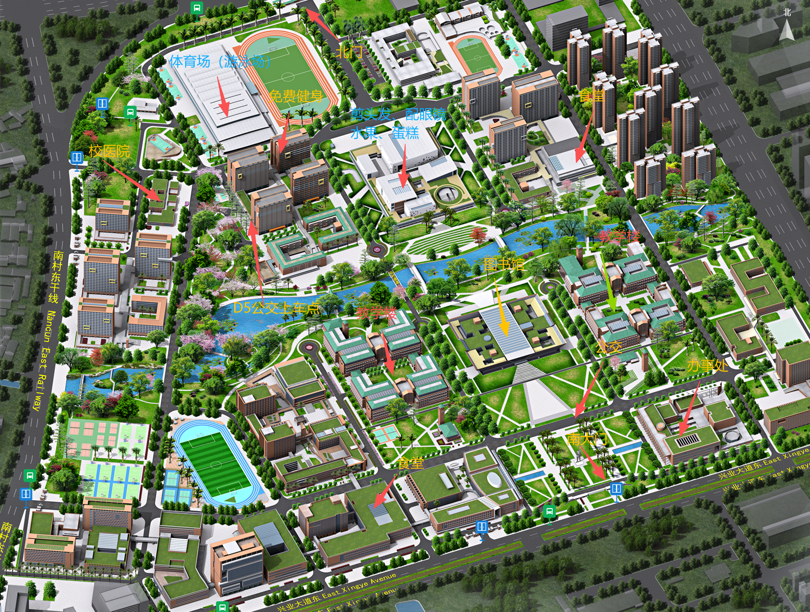
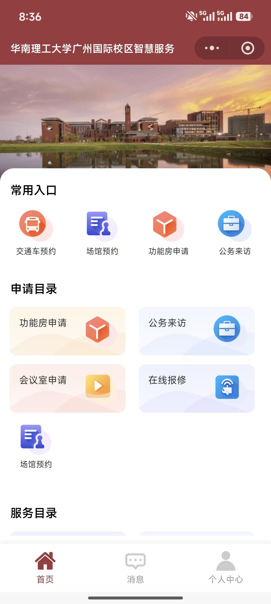
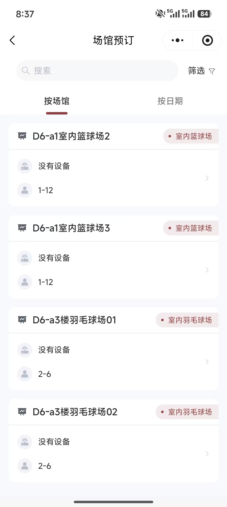
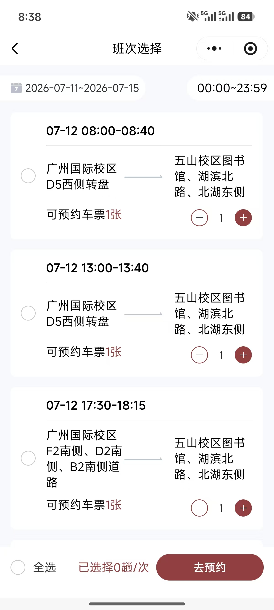

# 研究生校园生活手册

---

## 01｜先看懂校园方位

为了方便描述，可以把校园大致看作一个正方形：**从左到右依次为 A—G 区，从下到上依次为 1—5 区**，因此校园左下角为 `A1`。之后看到诸如 `D5`、`D6` 这样的地点，可以先按“字母看横向位置、数字看纵向位置”快速判断大致方位。

校园范围不小，**自行车是校内最常见、也比较方便的交通方式**。

下面这张校园总览图标出了本手册涉及的主要地点。

> **读图提示**：图中已标注校医院、食堂、体育场、免费健身房、理发及餐饮点、教学楼、图书馆、公交上车点和南大门等位置。

---

## 02｜先收藏：华南理工大学智慧服务

校内很多事务都集中在微信小程序 **“华南理工大学广州国际校区智慧服务”** 中，包括交通车预约、场馆预约、功能房申请、在线报修等。

打开微信，搜索 **“华南理工大学智慧服务”**，找到 **“GZIC智慧服务”** 小程序并进入即可。建议首次使用后将它添加到“我的小程序”，方便随时打开。

进入首页后，常用入口会直接显示在页面上。

---

## 03｜医疗与日常生活

### 校医院

校医院位于校园西北侧，具体位置见校园总览图。身体不适时可先前往校医院；如遇紧急情况，请优先联系急救或校方值班人员。

### 食堂

校内有多处食堂，分布在宿舍区和校园南侧等位置。

### 理发、咖啡与简餐

校园中部生活服务区域设有**理发、配眼镜、水果、蛋糕**等服务，附近也有咖啡、小面等餐饮选择。位置已在校园总览图中标出。

---

## 04｜运动与健身

学校设有**免费健身房**，位置见校园总览图。篮球场、羽毛球场、游泳馆等运动设施主要集中在**校医院旁的体育场区域**。

### 羽毛球场等场馆预约

预约路径：

**智慧服务小程序 → 场馆预约 → 选择场馆 → 选择日期与时段 → 提交预约**

场馆列表中可以看到室内篮球场、室内羽毛球场等项目；选择前请留意场地位置、可容纳人数和预约规则。

> **游泳馆例外**：游泳无需在小程序中预约，直接到现场线下付费即可。开放时间与收费标准以现场最新通知为准。

---

## 05｜校际公交预约与乘车

校际公交需要提前在智慧服务小程序中预约。

预约路径：

**智慧服务小程序 → 交通车预约 → 选择班次 → 核对上下车点 → 去预约**

广州国际校区常见上车点为 **D5 西侧转盘**，也就是校园环岛附近；校园内还有其他上车点，具体停靠位置取决于所购班次。

> **重要提醒**：不要连续失约 3 次。预约后若行程有变，请及时查看能否取消或调整，避免影响后续乘车。

## 06｜校园联系电话
https://web.scut.edu.cn/2018/0531/c15721a269066/page.htm
