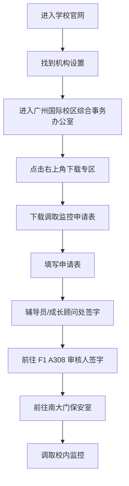

# 校内监控调取流程笔记

## 一、整体流程图

## 二、准备材料

调取校内监控前，需要先准备并填写《调取监控申请表》。

申请表需要完成两处签字：

- 辅导员签字：成长顾问处，可使用电子签。
- 审核人签名：前往 F1 A308 签字。

签字完成后，最后前往南大门保安室调取监控。

申请表文件可参考：[调取监控申请表](<申请表/ffbc49ac-8718-4af4-b7a8-b898143d7a7b (1).docx>)

## 三、下载申请表

### 1. 进入学校官网

第一步，先进入学校官网，在官网页面中找到“机构设置”。

### 2. 找到广州国际校区综合事务办公室

第二步，在“机构设置”中找到“广州国际校区综合事务办公室”。

### 3. 进入下载专区

第三步，进入广州国际校区综合事务办公室页面后，点击右上角的“下载专区”。

### 4. 下载调取监控申请表

在下载专区中找到“调取监控申请表”，下载后按要求填写。

## 四、填写申请表

申请表中，个人信息、调取事由、调取时间范围、地点等内容按实际情况正常填写。

需要注意的签字位置：

- “辅导员签字”由辅导员/成长顾问处签字，可使用电子签。
- “审核人签名”需要前往 F1 A308 签字。
- 表格填写到“以下部分由调取员填写 Following part should be filled out by viewer”前即可，后续部分由调取员填写。

## 五、前往 F1 A308 签字

申请表完成基础信息填写并取得辅导员签字后，前往 F1 A308 进行审核人签字。

路线指引如下：

1. 先来到南大门附近，也就是图书馆前面的位置。
2. 根据指引找到综合事务办公室所在区域。
3. 前往 F1 A308，完成审核人签字。

## 六、前往南大门保安室调取监控

完成以下事项后，即可前往南大门保安室调取监控：

- 申请表已填写完整。
- 辅导员/成长顾问处已签字。
- F1 A308 已完成审核人签字。

到达南大门保安室后，将签字完整的申请表交给工作人员，按工作人员要求配合调取监控即可。

## 七、简明检查清单

- [ ] 已在学校官网下载调取监控申请表。
- [ ] 已填写个人信息、调取事由、时间范围、地点等信息。
- [ ] 已完成辅导员/成长顾问处签字。
- [ ] 已前往 F1 A308 完成审核人签字。
- [ ] 已携带签字完整的申请表前往南大门保安室。

