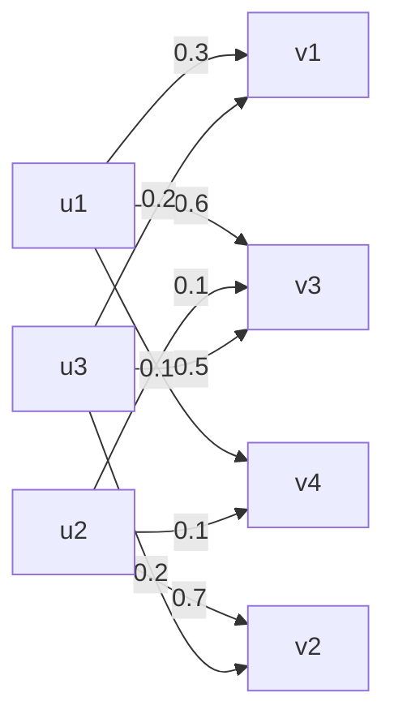
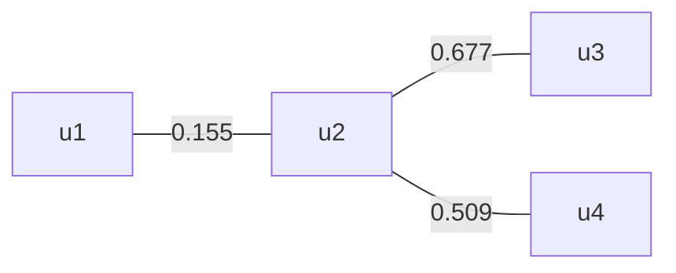

# 模糊数学打勾题答案汇总

---

## 第1章 F 集合

### 1

U={1,2,...,10}。可定义：

$$
A=1/1+0.9/2+0.8/3+0.6/4+0.4/5+0.2/6+0.1/7,
$$

$$
B=0.1/6+0.3/7+0.6/8+0.8/9+1/10.
$$

解释：越小的数在“A=小的数”中越像，越接近 10 的数在“B=接近 10”中越像。

### 2

在 U=R 上，“比 5 大得多的实数”可取：

$$
A(x)=
$$
分段如下：
0, x≤ 5,

$$
1-exp[-((x-5)/(3))^2], x>5.
$$

它从 x=5 后逐渐升高，越往右越接近 1。

### 3

$$
A=(0.5,0.1,0,1,0.8),
$$
$$
B=(0.1,0.4,0.9,0.7,0.2),
$$

$$
C=(0.8,0.2,1,0.4,0.3).
$$

逐点取最大、最小：

$$
A \cup  B=(0.5,0.4,0.9,1,0.8),
$$

$$
A \cap  B=(0.1,0.1,0,0.7,0.2),
$$

$$
(A \cup  B) \cap  C=(0.5,0.2,0.9,0.4,0.3),
$$

$$
A^c=(0.5,0.9,1,0,0.2).
$$

### 4

$$
A(x)=e^{-((x-1)/2)^2},  B(x)=e^{-((x-2)/2)^2}.
$$

两条钟形曲线在 x=3/2 相交。左边 A>B，右边 B>A，所以

$$
(A \cup  B)(x)=
$$
分段如下：
$$
A(x), x\le  3/2,
$$

$$
B(x), x\ge  3/2,
$$

 
$$
(A \cap  B)(x)=
$$
分段如下：
$$
B(x), x\le  3/2,
$$

$$
A(x), x\ge  3/2.
$$

$$
A^c(x)=1-e^{-((x-1)/2)^2}.
$$

示意：并集是两条曲线的“上包络”，交集是“下包络”。

   A峰    B峰
/|    /|
并集 /  _____/ |   取上面那条
交集 __/   __/     取下面那条
1 1.5 2

### 13

$$
A=0.2/a+0.5/b+0.6/c+0.7/d+1/e.
$$

$$
A_{0.2}={a,b,c,d,e},
$$
$$
A_{0.5}={b,c,d,e},
$$

$$
A_{0.6}={c,d,e},
$$
$$
A_{0.7}={d,e},
$$
$$
A_{1}={e}.
$$

### 14

$$
A(x)=e^{-x^2}.
$$

$$
A_{1/e}={x:e^{-x^2} \ge  e^{-1}}=[-1,1],
$$

$$
A_{1}={0},  A_{0}=R.
$$

### 20

由截集反推隶属函数：

$$
A_\lambda =
$$
分段如下：
$$
[0,10], \lambda =0,
$$

$$
[3,10], 0<\lambda \le  3/5,
$$

$$
[5\lambda ,10], 3/5<\lambda <1,
$$

$$
[5,10], \lambda =1.
$$

所以

$$
A(x)=
$$
分段如下：
$$
0, 0\le  x<3,
$$

$$
x/5, 3\le  x<5,
$$

1, 5≤ x≤ 10.

$$
SuppA=[3,10],  KerA=[5,10].
$$

### 21

由截集层层下降，可读出每个元素最高能留在哪一层：

$$
A=0.1/a+0.3/b+0.7/c+0.8/d+0.5/e.
$$

例如 d 能进入 0.8 层，所以 μ_A(d)=0.8；a 只在 0.1 层，所以 μ_A(a)=0.1。

### 25

题中强截集给出：

$$
A=(0.5,0.8,0.2,0.6,1,1)
$$

即

$$
A=0.5/1+0.8/2+0.2/3+0.6/4+1/5+1/6.
$$

普通截集：

$$
A_\lambda =
$$
分段如下：
U, 0≤λ≤0.2,

$$
{1,2,4,5,6}, 0.2<\lambda \le 0.5,
$$

$$
{2,4,5,6}, 0.5<\lambda \le 0.6,
$$

$$
{2,5,6}, 0.6<\lambda \le 0.8,
$$

$$
{5,6}, 0.8<\lambda \le 1.
$$

强截集：

$$
A_\lambda ^+=
$$
分段如下：
$$
U, 0\le \lambda <0.2,
$$

$$
{1,2,4,5,6}, 0.2\le \lambda <0.5,
$$

$$
{2,4,5,6}, 0.5\le \lambda <0.6,
$$

$$
{2,5,6}, 0.6\le \lambda <0.8,
$$

$$
{5,6}, 0.8\le \lambda <1,
$$

$$
\varnothing , \lambda =1.
$$

### 26

$$
H(\lambda )=[\lambda ^2-1,1-\lambda ^2],  0\le \lambda \le 1.
$$

对给定 x，它能进入的最高层满足

$$
\lambda ^2-1 \le  x \le  1-\lambda ^2.
$$

于是

$$
A(x)=
$$
分段如下：
$$
\sqrt(1+x), -1\le  x\le 0,
$$

$$
\sqrt(1-x), 0\le  x\le 1,
$$

0, 其他.

图像是一个“圆顶小山包”，在 x=0 达到 1。

μ
$$
1.0    *
$$
$$
0.7   *   *
$$
$$
0.0 *-----------*
$$
$$
-1   0   1
$$

### 27

由给出的集合套可读出：

$$
A=(0.5,0,0.3,0.7,0.5).
$$

$$
A_{0.5}={u1,u4,u5},
$$
$$
A^+_{0.5}={u4}.
$$

题中给定的集合套在 λ=0.5 处为

$$
H(0.5)={u4,u5}.
$$

注意：A0.5 是由最终隶属函数重新取截集；H(0.5) 是题目原来的集合套值。

### 28

$$
A=0.1/a+0.3/b+0.7/c+0.8/d+0.5/e.
$$

Shannon 型模糊熵：

$$
H(A)=-(1)/(5ln2)sum_{i}[
$$
$$
\mu _iln\mu _i+(1-\mu _i)ln(1-\mu _i)
$$
$$
]\approx  0.7906.
$$

Hamming 模糊度：

$$
d(A)=2/5sum_{imin}(\mu _i,1-\mu _i)
$$

$$
=2/5(0.1+0.3+0.3+0.2+0.5)=0.56.
$$

### 29

记 C=A_{1/2}。逐点看：

若 A(x)≥1/2，则 C(x)=1，

|A(x)-C(x)|=1-A(x)=1/2-|A(x)-1/2|.

若 A(x)<1/2，则 C(x)=0，

|A(x)-C(x)|=A(x)=1/2-|A(x)-1/2|.

所以恒有

|A(x)-A1/2(x)|=1/2-|A(x)-1/2|.

两边在 [α,β] 上积分，即得

$$
s1(A)=s2(A).
$$

---

## 第2章 贴近度与模式识别

### 1

差向量为

|A-B|=(0.2,0.2,0.5,0.2,0.2,0.1),
$$
sum |A-B|=1.4.
$$

海明贴近度：

$$
N_{H}(A,B)=1-1/6sum |A-B|
$$
$$
=1-1.4/6=0.7667.
$$

格贴近度：

$$
max_{i} min(A_{i},B_{i})=0.8,
$$
$$
min_{i} max(A_{i},B_{i})=0.3.
$$

$$
N_{L}(A,B)=min(0.8,1-0.3)=0.7.
$$

### 2

$$
A=(0.2,0.3,0.6,0.1,0.9),
$$
$$
B=(0.1,0.2,0.7,0.2,0).
$$

$$
sum (Ai-Bi)^2=0.85.
$$

欧氏贴近度：

$$
N_{E}(A,B)=1-\sqrt(0.85/5)
$$
≈ 0.5877.

### 3

两个三角形分别在 [0,2]、[1,3] 上，重叠部分的最小值是底长 1、高 0.5 的小三角形。

$$
area(A \cap  B)=(1/2)*1*0.5=0.25.
$$

每个大三角形面积为 1，因此

$$
integral |A-B|=1+1-2*0.25=1.5.
$$

黎曼贴近度：

$$
N_{R}(A,B)=1-(1/3)*integral_{0}^3 |A(x)-B(x)| dx
$$
$$
=1-1.5/3=0.5.
$$

若用格贴近度，最大交高为 0.5，故

$$
N_{L}(A,B)=0.5.
$$

### 4

三角形 F 集可写作

$$
A(x)=
$$
分段如下：
$$
(x-a+\sigma )/(\sigma ), a-\sigma \le  x\le  a,
$$

$$
(a+\sigma -x)/(\sigma ), a<x\le  a+\sigma ,
$$

0, 其他.

它在 x=a 处为 1，在区间外为 0。

$$
If A=(a1,\sigma 1), B=(a2,\sigma 2), and a1<a2, the maximum intersection height is
$$

$$
h=max(0,(\sigma 1+\sigma 2-(a2-a1))
$$
$$
{\sigma _1+\sigma _2}).
$$

有限支撑下外部有共同为 0 的地方，故格贴近度取

$$
N_{L}(A,B)=h.
$$

### 6

用

$$
A(x)=e^{-((x-a1)/\sigma )^2},
$$
$$
B(x)=e^{-((x-a2)/\sigma )^2}
$$

描述预报与实况。等宽 Gaussian 的格贴近度为

$$
N=exp[-((a1-a2)/(2\sigma ))^2].
$$

甲：Δ=5,σ=5，

N_甲=e^{-1/4}≈ 0.7788.

乙：Δ=10,σ=10，

N_乙=e^{-1/4}≈ 0.7788.

所以两人的预报成绩相同。

### 9

用格贴近度计算：

| object | N(*,A1) | N(*,A2) | N(*,A3) | result |
|---|---:|---:|---:|---|
| B1 | 0.4 | 0.5 | 0.3 | A2 |
| B2 | 0.5 | 0.3 | 0.4 | A1 |

所以 B1 属于第 2 类，B2 属于第 1 类。

### 10

样本 x0=4.6，各类隶属度为：

$$
\mu _1=e^{-9}=0.000123,
$$
$$
\mu _2=e^{-32.111}\approx  0,
$$

$$
\mu _3=e^{-11.111}=0.0000149,
$$
$$
\mu _4=e^{-5.444}=0.00432,
$$

$$
\mu _5=e^{-20.25}\approx  0.
$$

最大的是 μ_4，故判为第 4 类，即“高肥丰产”。

### 11

三边为 89,46,45。指标：

$$
I=1-(min(43,1))/(60)=59/60=0.9833,
$$

$$
R=1-(|89-90|)/(90)=89/90=0.9889,
$$

$$
E=1-(89-45)/(180)=136/180=0.7556.
$$

$$
I \cap  R=min(I,R)=0.9833,
$$
$$
T=1-max(I,R,E)=0.0111.
$$

最大的是 R，故它最接近直角三角形。

### 12

将频数除以 320，得三个语言值：

| 车速 | 1 | 2 | 3 | 4 | 5 | 6 | 7 | 8 | 9 | 10 | 11 | 12 | 13 | 14 | 15 |
|---|---:|---:|---:|---:|---:|---:|---:|---:|---:|---:|---:|---:|---:|---:|---:|
| 慢 | 1 | 1 | 0.953 | 0.684 | 0.509 | 0.288 | 0.128 | 0.047 | 0 | 0 | 0 | 0 | 0 | 0 | 0 |
| 中 | 0 | 0 | 0 | 0.134 | 0.594 | 0.944 | 1 | 0.925 | 0.722 | 0.350 | 0.184 | 0 | 0 | 0 | 0 |
| 快 | 0 | 0 | 0 | 0 | 0 | 0 | 0 | 0.263 | 0.378 | 0.538 | 0.728 | 0.878 | 1 | 1 | 1 |

直观看：慢在左边高，中在中间鼓起，快在右边高。

### 13

可用 Cauchy 型函数给出一组合理定义，例如：

$$
Y(x)=
$$
分段如下：
1, x≤25,

$$
1/(1+0.01(x-25)^2), x>25,
$$

$$
O(x)=
$$
分段如下：
0, x≤50,

$$
((x-50)^2)/(100+(x-50)^2), x>50.
$$

中年可取

$$
M(x)=min(1-Y(x),1-O(x)).
$$

这不是唯一答案，参数体现的是建模者对“青年、老年”的主观划分。

### 14

设两个随机边界

$$
xi~ N(1,4),  eta~ N(2,4).
$$

记 Φ 为标准正态分布函数，则

μ_{小雨}(x)=P(xi≥ x)=1-Φ((x-1)/(2)),

μ_{中雨}(x)=P(xi≤ x≤eta)
$$
=\Phi ((x-1)/(2))-\Phi ((x-2)/(2)),
$$

μ_{大雨}(x)=P(eta≤ x)=
$$
\Phi ((x-2)/(2)).
$$

---

## 第3章 F 关系

### 1

关系矩阵为

$$
R=
$$

0.3 0 0.6 0.1

0 0.7 0.1 0.1

0.2 0.2 0.5 0
.

$$
R(u1,v2)=0,  R(u1,v4)=0.1,
$$

$$
R(u2,v2)=0.7,  R(u3,v1)=0.2.
$$

非零边可画成：

### 2

在 (3,2) 处，

$$
R1(3,2)=e^{-(3-2)^2}=e^{-1}.
$$

$$
R2(3,2) is also e^{-1}, so
$$

$$
(R1 \cup  R2)(3,2)=e^{-1},
$$
 
$$
(R1 \cap  R2)(3,2)=e^{-1}.
$$

### 3

$$
R1 \cup  R2=
$$

0.7 0.2 0.8

0.9 0.5 0.6

1 0.5 0.3
,

$$
R1 \cap  R2=
$$

0.1 0 0.4

0.3 0.1 0

0 0.4 0.2
.

$$
R1^T=
$$

0.1 0.9 0

0 0.5 0.4

0.8 0 0.3
,
 
$$
R1^c=
$$

0.9 1 0.2

0.1 0.5 1

1 0.6 0.7
.

### 7

$$
R=
$$

0.7 0.6 0.5 0.8

0.6 0.9 1 0.8

0.7 0.4 0.3 0.2
.

$$
R_{0.5}=
$$

1 1 1 1

1 1 1 1

1 0 0 0
,
 
$$
R_{0.9}=
$$

0 0 0 0

0 1 1 0

0 0 0 0
.

$$
R^+_{0.4}=
$$

1 1 1 1

1 1 1 1

1 0 0 0
,
 
$$
R^+_{0.9}=
$$

0 0 0 0

0 0 1 0

0 0 0 0
.

$$
(u3,v1) has degree 0.7, so it belongs to R_{0.5} and R^+_{0.4}, but not to R_{0.9} or R^+_{0.9}.
$$

$$
(u2,v4) has degree 0.8, so it belongs to R_{0.8}, but not to R^+_{0.8}.
$$

### 8

$$
R(u,v)=e^{-(u-v)^2}.
$$

$$
R(\sqrt(ln2),0)=e^{-ln2}=1/2,
$$

所以它在 R_{0.5} 中相关。

$$
R(1+\sqrt(ln3),1)=e^{-ln3}=1/3<0.5,
$$

所以不在 R_{0.5} 中相关。

### 13

$$
R1 \circ  R2=
$$

0.8 1

0.6 0.5

0.8 0.9
.

$$
R1 \circ  R2^c=
$$

0.4 0.5

0.4 0.6

0.7 0.4
.

$$
(R1)_{0.6} \circ  (R2)_{0.6}=
$$

1 1

1 0

1 1
.

### 14

$$
R1(u,v)=e^{-\lambda (u-v)^2},
$$
$$
R2(v,w)=e^{-k(v-w)^2}.
$$

合成时要最大化

$$
min{e^{-\lambda (u-v)^2}, e^{-k(v-w)^2}}.
$$

等价于让两个指数的惩罚尽量平衡：

$$
\sqrt(\lambda )|u-v|=\sqrt(k)|v-w|.
$$

可得

$$
(R1 \circ  R2)(u,w)
$$
$$
=exp[
$$
$$
-(\lambda *k)/((\sqrt(\lambda )+\sqrt(k))^2)(u-w)^2
$$
$$
].
$$

$$
For R1^c \circ  R2^c on the whole real line, let |v| \to  infinity; both complements tend to 1, so
$$

$$
(R1^c \circ  R2^c)(u,w)=1.
$$

### 18

原关系：

$$
R=
$$

1 0.4 0.9 0.6

0.4 1 0.7 0.5

0.9 0.7 1 0.8

0.6 0.5 0.8 1
.

传递闭包为

$$
hat R=
$$

1 0.7 0.9 0.8

0.7 1 0.7 0.7

0.9 0.7 1 0.8

0.8 0.7 0.8 1
.

For example, u1 can connect to u4 through u3, raising the similarity to 0.8.

### 23

传递闭包为

$$
hat R=
$$

1 0.8 0.4 0.5 0.8

0.8 1 0.4 0.5 0.9

0.4 0.4 1 0.4 0.4

0.5 0.5 0.4 1 0.5

0.8 0.9 0.4 0.5 1
.

λ=0.8 截集为

1 1 0 0 1

1 1 0 0 1

0 0 1 0 0

0 0 0 1 0

1 1 0 0 1
.

分类结果：

$$
{u1,u2,u5},  {u3},  {u4}.
$$

### 24

用绝对值距离法，取

$$
r_{ij}=1-d_{ij}/226.
$$

距离矩阵：

$$
D=
$$

0 191 214 226

191 0 73 111

214 73 0 132

226 111 132 0
.

相似矩阵：

$$
R=
$$

1 0.155 0.053 0

0.155 1 0.677 0.509

0.053 0.677 1 0.416

0 0.509 0.416 1
.

传递闭包：

$$
hat R=
$$

1 0.155 0.155 0.155

0.155 1 0.677 0.509

0.155 0.677 1 0.509

0.155 0.509 0.509 1
.

动态聚类：

| λ 范围 | 分类 |
|---|---|
| 0.677<λ≤1 | {u1},{u2},{u3},{u4} |
| 0.509<λ≤0.677 | {u2,u3},{u1},{u4} |
| 0.155<λ≤0.509 | {u2,u3,u4},{u1} |
| 0≤λ≤0.155 | {u1,u2,u3,u4} |

最大树：

---

## 第4章 F 变换与综合评价

### 1

$$
R=
$$

0.1 0.3 0.5 0.9

1 0.7 0.2 0.3

0 0.2 0.1 1
.

$$
f(u1)=(0.1,0.3,0.5,0.9),
$$

$$
f(u2)=(1,0.7,0.2,0.3),
$$

$$
f(u3)=(0,0.2,0.1,1).
$$

按列看：

$$
R|v1=(0.1,1,0),
$$
$$
R|v2=(0.3,0.7,0.2),
$$

$$
R|v3=(0.5,0.2,0.1),
$$
$$
R|v4=(0.9,0.3,1).
$$

### 2

$$
R(u,v)=1/(1+k(u-v)^2).
$$

则

$$
f(u)(v)=R(u,v)=1/(1+k(u-v)^2).
$$

四个截面为

$$
R|u=0(v)=1/(1+k*v^2),
$$
 
$$
R|v=0(u)=1/(1+k*u^2),
$$

$$
R|u=1(v)=1/(1+k(1-v)^2),
$$
 
$$
R|v=1(u)=1/(1+k(u-1)^2).
$$

### 4

$$
R(x,y)=e^{-(x-y)^2},  A(x)=e^{-x^2/4}.
$$

$$
T_{R}(A)(y)=sup_{x} min(e^{-x^2/4}, e^{-(x-y)^2}).
$$

最优处让两个指数惩罚相等：

$$
x^2/4=(x-y)^2.
$$

由 Gaussian 合成规律得

$$
T_{R}(A)(y)=e^{-y^2/9}.
$$

### 5

$$
R=
$$

1 0 1 0

0 1 0 0

0 0 1 1
.

若 A={u1,u3}=(1,0,1)，

$$
T_{R}(A)=(1,0,1,1).
$$

若 B=(0.5,0.3,0)，

$$
T_{R}(B)=(0.5,0.3,0.5,0).
$$

### 6

$$
R=
$$

0.2 0.7 0 0.1

0 1 0.3 0.2

0.4 0.5 0 0.6
.

若 A={u1,u2}=(1,1,0)，

$$
T_{R}(A)=(0.2,1,0.3,0.2).
$$

若 B=(0.1,0.3,0.7)，

$$
T_{R}(B)=(0.4,0.5,0.3,0.6).
$$

### 7

$$
f(u1)=(0.5,0.2,0,1),
$$

$$
f(u2)=(1,0.3,0.5,0),
$$

$$
f(u3)=(0.7,0.1,0.2,0.9).
$$

若 A={u1,u2}，

$$
T_{f}(A)=(1,0.3,0.5,1).
$$

若 B=(0.9,0.3,1)，

$$
T_{f}(B)=(0.7,0.3,0.3,0.9).
$$

### 13

评价矩阵

$$
R=
$$

0.3 0.6 0.1 0

0 0.2 0.5 0.3

0.5 0.3 0.1 0.1

0.1 0.3 0.2 0.4
.

第一组权重 A1=(0.5,0.2,0.2,0.1)：

$$
B1=A1 \circ  R=(0.3,0.5,0.2,0.2).
$$

最大为第二等级。

第二组权重 A2=(0.2,0.4,0.1,0.3)：

$$
B2=A2 \circ  R=(0.2,0.3,0.4,0.3).
$$

最大为第三等级。

### 14

目标评价：

$$
B=(0.1,0.2,0.4,0.3).
$$

用加权平均型综合评价 Bi=AiR，再用格贴近度比较：

| 方案 | AiR | 与目标贴近度 |
|---|---|---:|
| A1 | (0.15,0.34,0.31,0.20) | 0.31 |
| A2 | (0.20,0.35,0.27,0.18) | 0.27 |
| A3 | (0.19,0.33,0.25,0.23) | 0.25 |
| A4 | (0.14,0.32,0.29,0.25) | 0.29 |

最大贴近度对应 A1，所以选择 A1。

### 15

$$
max(min(x1,0.6), min(x2,0.7), min(x3,0.5), min(x4,0.3))=0.5.
$$

要使最大值恰为 0.5，先要求所有项不超过 0.5：

x1≤0.5,  x2≤0.5.

同时至少有一项达到 0.5。解集为

$$
{0.5} \times  [0,0.5] \times  [0,1] \times  [0,1]
$$

$$
union [0,0.5] \times  {0.5} \times  [0,1] \times  [0,1]
$$

$$
union [0,0.5] \times  [0,0.5] \times  [0.5,1] \times  [0,1].
$$

### 16

第一组方程：

$$
(x1,x2,x3) \circ 
$$

0.3 0.5 0.2

0.1 0.3 0.4

0 0.6 0.1

$$
=(0.2,0.5,0.2).
$$

$$
Column 1 requires x1=0.2; column 2 requires x3=0.5; column 3 gives x2\le 0.2.
$$

因此

$$
x1=0.2,  x3=0.5,  0\le x2\le 0.2.
$$

$$
The second system has no solution: column 1 requires x4\ge 0.7, but then min(x4,0.5)\ge 0.5 conflicts with target 0.4.
$$

所以第二组方程无解。

---

## 第5章 扩张原理与 F 数

### 1

映射：a,d,e,f → x，b,c → y，z 无原像。

$$
A=0.1/a+0.4/b+1/c+0.6/d+0.3/e.
$$

$$
f(A)=0.6/x+1/y+0/z.
$$

$$
f^{-1}(f(A))=0.6/a+1/b+1/c+0.6/d+0.6/e+0.6/f.
$$

$$
A^c=0.9/a+0.6/b+0/c+0.4/d+0.7/e+1/f.
$$

$$
f(A^c)=1/x+0.6/y+0/z.
$$

若

$$
A'=1/a+0.8/b+0.5/c+0.2/f,
$$

则

$$
f(A \cup  A')=1/x+1/y+0/z.
$$

$$
f({a,b})={x,y},  f({b,c})={y}.
$$

$$
f(A)_{0.6}={x,y}.
$$

### 2

$$
f(x)=x/2.
$$

$$
A(x)=
$$
分段如下：
$$
x-1, 1<x\le 2,
$$

$$
3-x, 2<x<3,
$$

0, 其他.

由扩张原理，

$$
f(A)(y)=A(2y).
$$

所以

$$
f(A)(y)=
$$
分段如下：
$$
2y-1, 1/2<y\le 1,
$$

$$
3-2y, 1<y<3/2,
$$

0, 其他.

### 3

$$
f(x)=1+1/2(x+1)^2.
$$

令

$$
t=\sqrt(2(y-1)).
$$

原像为

$$
x=-1 ± t.
$$

扩张后

$$
f(A)(y)=
$$
分段如下：
$$
(2+\sqrt(2(y-1)))/3, 1\le  y\le 1.5,
$$

$$
2-\sqrt(2(y-1)), 1.5<y<3,
$$

0, 其他.

### 11

区间运算：

$$
[3,9]+[7,10]=[10,19].
$$

$$
[6,15] / [2,8]=[0.75,7.5].
$$

$$
([3,9]+[6,9])*[-1,4]=[9,18]*[-1,4]=[-18,72].
$$

$$
([2,6]-[-1,4])*([6,9]-[-4,-2])
$$
$$
=[-2,7]*[8,13]=[-26,91].
$$

$$
max([2,6],[5,5])=[5,6],
$$
 
$$
min([4,7],[-2,9])=[-2,7].
$$

### 12

用区间序关系比较：

$$
1. [0,3]\le [1,4]。
$$

2. [2,3]*[-2,1]=[-6,3]，而 [-4,6] 更大。

$$
3. [2,3]*[-2,2]=[-6,6]，
$$
[-2,4]*[-2,1]=[-8,4]。前者更大。

### 15

$$
~ 2=0.4/1+1/2+0.7/3,
$$
 
$$
~ 3=0.5/2+1/3+0.6/4.
$$

加法：

$$
~2+~3
$$
$$
=0.4/3+0.5/4+1/5+0.7/6+0.6/7.
$$

乘法：

~2~3
$$
=0.4/2+0.4/3+0.5/4+1/6+0.6/8+0.7/9+0.6/12.
$$

### 17

~2=(1,2,3)，~3=(2,3,4) 均为三角 F 数。

和：

$$
~2+~3=(3,5,7),
$$

$$
\mu _{~2+~3}(z)=
$$
分段如下：
$$
(z-3)/(2), 3\le  z\le 5,
$$

$$
(7-z)/(2), 5<z\le 7,
$$

0, 其他.

差：

$$
~2-~3=(-3,-1,1),
$$

$$
\mu _{~2-~3}(z)=
$$
分段如下：
$$
(z+3)/(2), -3\le  z\le -1,
$$

$$
(1-z)/(2), -1<z\le 1,
$$

0, 其他.

---

## 第7章 F 语言与 F 推理

### 2

在 U={1,...,9} 上取

小=(1,0.8,0.6,0.4,0.2,0,0,0,0),

大=(0,0,0,0,0.2,0.4,0.6,0.8,1).

则

不大也不小=min(1-大,1-小)

$$
=(0,0.2,0.4,0.6,0.8,0.6,0.4,0.2,0).
$$

大或小=max(大,小)
$$
=(1,0.8,0.6,0.4,0.2,0.4,0.6,0.8,1).
$$

### 4

大=(0,0,0,0.2,0.8,1),
 
小=(1,0.8,0.2,0,0,0).

很大=大^2=(0,0,0,0.04,0.64,1).

不很小=1-小^2=(0,0.36,0.96,1,1,1).

偏向大=(0,0,0,0,1,1).

极小=小^4=(1,0.4096,0.0016,0,0,0).

不大也不小=min(1-大,1-小)
$$
=(0,0.2,0.8,0.8,0.2,0).
$$

### 5

若普通集合 A 表示“5”，相似关系为

$$
N(x,5)=
$$
分段如下：
$$
1/(\sqrt(2pi)*\sigma )
$$
$$
exp[-((x-5)^2)/(2*\sigma ^2)],
$$
 |x-5|<delta,

0, 其他.

则诱导的 F 语言值为

$$
F(A)(x)=N(x,5).
$$

### 6

“年老”的倾向算子 P1/2 相当于以 0.5 为阈值。

因此

倾向年老(u)=
分段如下：
0, u≤55,

$$
1, 55<u\le 100.
$$

阈值点 u=55 处若按强阈值取 0，按普通阈值可取 1，分类结论不受影响。

### 7

轻=(1,0.8,0.6,0.4,0.2),
 
重=(0.2,0.4,0.6,0.8,1).

不很轻=1-轻^2=(0,0.36,0.64,0.84,0.96).

不很重=1-重^2=(0.96,0.84,0.64,0.36,0).

不轻也不重=min(1-轻,1-重)
$$
=(0,0.2,0.4,0.2,0).
$$

### 9

语法规则化简：

$$
B=b,  C=max(0.5a,0.2aa).
$$

$$
A=max(a,0.5ab,0.2b,0.5aa,0.2aaa,0.9aAb).
$$

所以

$$
G=S=Ab
$$
$$
=max(ab,0.5abb,0.2bb,0.5aab,0.2aaab,0.9aGb).
$$

于是

$$
G(ab)=1.
$$

而 aaaabb 可看成 a(aaab)b，其中 aaab 的生成度为 0.2，再乘外层 0.9 取小后仍为 0.2：

$$
G(aaaabb)=0.2.
$$

### 10

F 蕴含“若 A 则 B”可写成

$$
A^c \cup  (A \cap  B).
$$

第一条：若 A(u)>1/2 且蕴含为真，则 B(u)>1/2。

第二条：若 B(u)<1/2 且蕴含为真，则 A(u)<1/2。

第三条：因为

$$
(A=>C) \ge  min(A=>B, B=>C),
$$

所以两个规则串联后仍能推出 A=>C。这就是 F 推理里的“传递”思想。

### 11

轻=L=(1,0.8,0.3,0.1,0),
 
重=H=(0,0.1,0.3,0.8,1).

1. 规则“若 × 很重，则 y 很轻”，输入 × 重：

$$
B1=(1,0.64,0.36,0.36,0.36).
$$

2. 规则“若 × 重，则 y 轻”，输入 × 很重：

$$
B2=(1,0.8,0.3,0.2,0.2).
$$

3. 规则“若 × 重，则 y 轻；否则 y 不很轻”，输入 × 轻：

$$
B3=(0.3,0.36,0.91,0.99,1).
$$

直观理解：输入越不像“重”，系统越走“否则”分支，因此输出越来越接近“不很轻”。

### 12

$$
A=(1,0.5,0.1),  B=(0.1,0.6,1).
$$

关系 R=A×B 为

$$
R=
$$

0.1 0.6 1

0.1 0.5 0.5

0.1 0.1 0.1
.

输入

$$
A'=(0.5,0.9,0.4).
$$

合成输出：

$$
B'=A' \circ  R=(0.1,0.5,0.5).
$$

---

## 第8章 F 控制

### 1

设水温误差与控制量均在 {1,2,3,4,5} 上。可定义：

小=(1,0.7,0.3,0,0),

中=(0,0.5,1,0.5,0),

大=(0,0,0.3,0.7,1).

控制规则：

R=(大 × 大) ∪ (中 × 中) ∪ (小 × 小).

矩阵为

$$
R=
$$

1 0.7 0.3 0 0

0.7 0.7 0.5 0.5 0

0.3 0.5 1 0.5 0.3

0 0.5 0.5 0.7 0.7

0 0 0.3 0.7 1
.

若输入量 A=大，则

$$
B=A \circ  R=(0.3,0.5,0.5,0.7,1).
$$

所以控制输出仍偏“大”：误差大，就多给热量。

### 2

取论域

$$
X=Y={-3,-2,-1,0,1,2,3}.
$$

设语言值：

$$
NB=(1,0.5,0,0,0,0,0),
$$
$$
NS=(0,0.5,1,0.5,0,0,0),
$$

$$
ZE=(0,0,0.5,1,0.5,0,0),
$$
$$
PS=(0,0,0,0.5,1,0.5,0),
$$

$$
PB=(0,0,0,0,0,0.5,1).
$$

规则为

PB→ NB,  PS→ NS,  ZE→ ZE,  NS→ PS,  NB→ PB.

即温度偏低时加热，温度偏高时降热。

对

$$
A1=(0.2,1,0.3,0,0,0,0),
$$

合成得

$$
B1=(0,0,0.3,0.5,0.5,0.5,0.5).
$$

重心法精确化：

y1 ≈ 1.174.

对

$$
A2=(0.5,1,0.1,0,0,0,0),
$$

$$
B2=(0,0,0.1,0.5,0.5,0.5,0.5),
$$

y2 ≈ 1.381.

若采用最大隶属度法，两者的最大响应都落在 y=0,1,2,3 的平台上；重心法给出更细的正向加热量。

### 3

设误差 x、误差变化 xdot、控制量 q 的语言值均为

NB,NS,ZE,PS,PB.

根据题中规则表，三元 F 关系写成：

$$
R(x,\dot{x},q)=
$$
max over i,j
$$
min(A_{i}(x), B_{j}(\dot{x}), C_{ij}(q)).
$$

其中规则表为：

| × / xdot | NB | NS | ZE | PS | PB |
|---|---|---|---|---|---|
| PB | ZE | NS | NS | NS | NB |
| PS | PS | ZE | NS | NS | NB |
| ZE | PS | ZE | ZE | ZE | NS |
| NS | PB | PS | PS | ZE | NS |
| NB | PB | PB | PB | PS | ZE |

也就是把 25 条“若 × 为某值且 xdot 为某值，则 q 为某值”的规则全部用并运算叠起来。

---

## 第10章 F 概率

### 3

射击直到第一次命中，设每次命中概率为 p。命中所需次数 N 服从几何分布：

$$
P(N=n)=(1-p)^{n-1}p.
$$

“约 3 次击中”：

$$
A=0.2/1+0.7/2+1/3+0.7/4+0.1/5.
$$

所以

$$
P(A)=0.2p+0.7(1-p)p+(1-p)^2 p
$$

$$
+0.7(1-p)^3 p+0.1(1-p)^4 p.
$$

### 4

设废品数 X~ B(100,0.01)。题中

$$
A=0.6/1+1/2+0.5/3.
$$

$$
P(A)=0.6P(X=1)+P(X=2)+0.5P(X=3).
$$

$$
P(X=k)=C(100,k)0.01^k0.99^{100-k}.
$$

代入：

$$
P(A)\approx  0.4372.
$$

### 5

记“很可能”为 H(x)。题中

$$
H(x)=
$$
分段如下：
0, 0≤ x≤0.7,

$$
2((x-0.7)/(0.3))^2, 0.7\le x\le 0.8,
$$

$$
1-2((x-1)/(0.3))^2, 0.8\le x\le 1.
$$

“很不可能”可取 H(1-x)。令

$$
C=0.6H+0.3H(1-x).
$$

由扩张原理，设

$$
m(x)=min((x)/(0.6),(0.9-x)/(0.3)),
$$

则

$$
C(x)=
$$
分段如下：
0, x<0.42 或 x>0.69,

$$
H(m(x)), 0.42\le  x\le 0.69.
$$

它的峰值在 x=0.6：这很合理，因为“0.6 个很可能 + 0.3 个很不可能”大约落在 0.6 附近。

### 6

$$
Omega={omega1,omega2,omega3},
$$
 
$$
A=0.6/omega1+1/omega2+0.7/omega3.
$$

$$
p(A)=0.6*\pi _omega1+\pi _omega2+0.7*\pi _omega3.
$$

逐项用扩张原理合成，得

$$
p(A)= 0.5/0.66+0.5/0.72+0.6/0.73+0.5/0.76
$$

$$
+0.5/0.78+0.6/0.79+0.4/0.80+0.5/0.82
$$

$$
+0.7/0.83+0.6/0.85+0.5/0.86+0.5/0.88
$$

$$
+1/0.89+0.4/0.90+0.5/0.92+0.5/0.93
$$

$$
+0.6/0.95+0.4/0.96+0.5/0.98+0.5/0.99
$$

$$
+0.4/1.00+0.4/1.02+0.5/1.05+0.4/1.06+0.4/1.12.
$$

中心最高点为 0.89，说明该 F 事件的概率最像 0.89。

---

## 第11章 F 规划

### 3

$$
U={x1,x2,x3,x4},
$$
$$
f(x1)=0, f(x2)=3, f(x3)=-1, f(x4)=1.
$$

设

$$
A=a1/x1+a2/x2+a3/x3+a4/x4.
$$

天然 F 扩张为

$$
~ f(A)=a3/(-1)+a1/0+a4/1+a2/3.
$$

也就是把每个元素的隶属度搬到它的函数值上。

### 4

满意函数

$$
f(x)=(x)/(2)e^{1-x/10}.
$$

最大值在 x=10。规范化目标隶属函数：

$$
G(x)=(f(x))/(f(10))
$$
$$
=(x)/(10)e^{1-x/10}.
$$

约束：

$$
A(x)=
$$
分段如下：
1, 0≤ x≤1,

$$
1/(1+(x-1)^2), 1<x\le 100.
$$

对称型 F 规划取

$$
D(x)=min(G(x), A(x)).
$$

最优点在两条曲线相交处：

$$
(x)/(10)e^{1-x/10}
$$
$$
=1/(1+(x-1)^2).
$$

解得

x ≈ 2.084.

此时

$$
D(x)\approx  0.4599.
$$

所以最佳投放量约为 2.08 g。

### 5

F 线性规划：

$$
max z=x1+2x2
$$

$$
2x1+3x2 ≲ 4,  -x1+2x2 ≲ -1,
$$
  x1,x2≥0.

$$
d1=2,  d2=1.
$$

严格约束下最优值：

$$
z0=15/7.
$$

放宽约束下最优值：

$$
z1=24/7.
$$

引入满意度 λ，转化为

$$
x1+2x2\ge  z0+\lambda (z1-z0),
$$

$$
2x1+3x2\le 6-2\lambda ,
$$

$$
-x1+2x2\le -\lambda .
$$

解得

$$
x1=23/14,  x2=4/7,  \lambda =1/2.
$$

$$
z=39/14 \approx  2.7857.
$$

### 6

设 x1,x2 分别为产品 A1,A2 的产量，单位为万瓶。

模型：

$$
max Z=8000x1+3000x2
$$

$$
5x1+3x2\le 500,
$$

$$
300x1+80x2\le 20000,
$$

$$
12x1+4x2\le 900,  x1,x2\ge 0.
$$

最优解出现在前两个资源约束交点：

分段如下：
$$
5x1+3x2=500,
$$

$$
300x1+80x2=20000.
$$

解得

$$
x1=40,  x2=100.
$$

最大利润：

Z=8000*40+3000*100=620000 元.

即生产 A1 40 万瓶，A2 100 万瓶。

### 7

题中 F 规划：

$$
max s=2x1+2x2
$$

$$
x1+x2 ≲ 5,  -x1+x2 ≲ 0,
$$
$$
6x1+2x2 ≲ 21.
$$

$$
d1=1,  d2=2,  d3=3.
$$

严格约束下最优值：

$$
s0=10.
$$

放宽约束下最优值：

$$
s1=12.
$$

引入满意度 λ：

$$
2x1+2x2\ge 10+2\lambda ,
$$

$$
x1+x2\le 6-\lambda ,
$$

$$
-x1+x2\le 2-2\lambda ,
$$

$$
6x1+2x2\le 24-3\lambda .
$$

解得最大满意度

$$
\lambda =1/2,  s=11.
$$

此时

$$
x1+x2=5.5,
$$

并满足

$$
2.25\le x1\le 2.875,  x2=5.5-x1.
$$

例如可取

$$
(x1,x2)=(2.25,3.25)
$$

或

$$
(x1,x2)=(2.875,2.625).
$$

这一段都是最优折中解：满意度为 0.5，目标值为 11。
