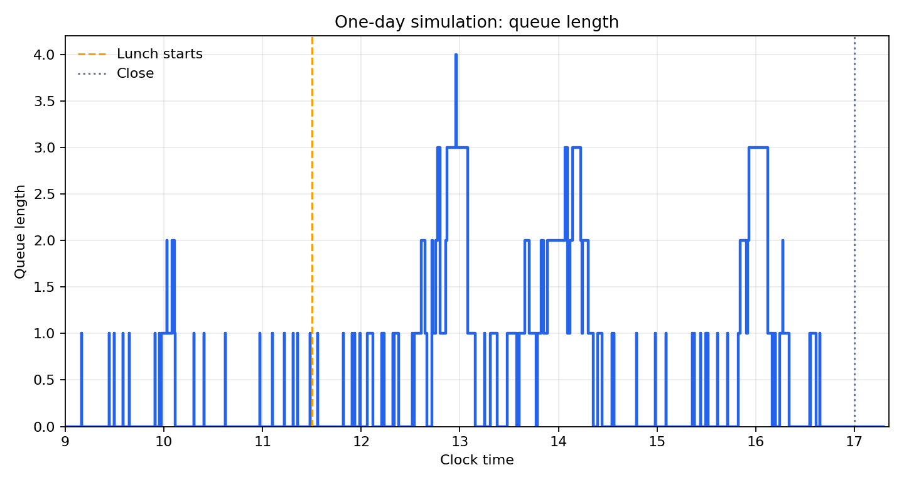
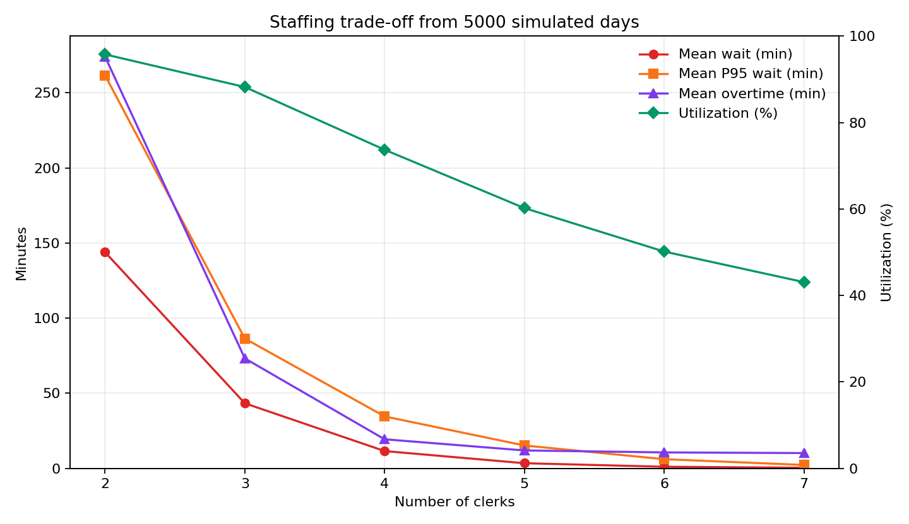

# 随机过程小测与项目答案

本文按图片中的题目顺序整理。所有时间题若无特别说明，均使用题目给定的时间单位。

## 小测1

### 第1题

**题目。** 设 $X(t)=A\cos(\lambda t)+B\sin(\lambda t)$，其中 $A,B$ 是独立同分布的随机变量，服从 $N(0,\sigma^2)$，$\lambda$ 为实数。求过程 $\{X(t),t\in T\}$ 的均值函数、方差函数和协方差函数。证明 $\{X(t),t\in T\}$ 为宽平稳过程，并讨论 $\{X(t),t\in T\}$ 是否具有均值遍历性。

**解答。** 因为 $A,B$ 独立且均值均为 $0$，所以

$$
\begin{aligned}
m_X(t)
&=\mathbb{E}[X(t)] \\
&=\mathbb{E}[A]\cos(\lambda t)+\mathbb{E}[B]\sin(\lambda t) \\
&=0 .
\end{aligned}
$$

方差为

$$
\begin{aligned}
\operatorname{Var}[X(t)]
&=\operatorname{Var}[A\cos(\lambda t)+B\sin(\lambda t)] \\
&=\sigma^2\cos^2(\lambda t)+\sigma^2\sin^2(\lambda t) \\
&=\sigma^2 .
\end{aligned}
$$

协方差函数为

$$
\begin{aligned}
R_X(s,t)
&=\operatorname{Cov}(X(s),X(t)) \\
&=\mathbb{E}[X(s)X(t)] \\
&=\sigma^2\cos(\lambda s)\cos(\lambda t)+\sigma^2\sin(\lambda s)\sin(\lambda t) \\
&=\sigma^2\cos(\lambda(t-s)).
\end{aligned}
$$

均值为常数，协方差只依赖于时间差 $t-s$，因此该过程为宽平稳过程。

令时间平均为

$$
\overline{X}_T=\frac{1}{T}\int_0^T X(t)\,dt .
$$

当 $\lambda\neq 0$ 时，

$$
\begin{aligned}
\operatorname{Var}(\overline{X}_T)
&=\frac{2}{T^2}\int_0^T (T-\tau)\sigma^2\cos(\lambda \tau)\,d\tau \\
&=\frac{2\sigma^2}{T^2}\cdot \frac{1-\cos(\lambda T)}{\lambda^2} \\
&\to 0,\qquad T\to\infty .
\end{aligned}
$$

因此当 $\lambda\neq 0$ 时，该过程具有均值遍历性。若 $\lambda=0$，则 $X(t)=A$，时间平均恒为 $A$，不收敛到总体均值 $0$，所以不具有均值遍历性。

### 第2题

**题目。** 若 $N(t)$ 为泊松过程，令 $Y(t)=\alpha N(t)+\beta t+\gamma$，其中 $\alpha,\beta,\gamma\in\mathbb{R}$ 为常数，证明 $Y(t)$ 为独立平稳增量过程。

**解答。** 对 $0\leq s<t$，有

$$
Y(t)-Y(s)=\alpha[N(t)-N(s)]+\beta(t-s).
$$

泊松过程 $N(t)$ 具有独立增量，因此任意不相交区间上的 $N(t)-N(s)$ 相互独立，而 $Y$ 的增量只是这些增量的线性变换，所以 $Y(t)$ 具有独立增量。

又因为 $N(t)-N(s)\sim \operatorname{Poisson}(t-s)$，其分布只依赖于区间长度 $t-s$，所以 $Y(t)-Y(s)$ 的分布也只依赖于 $t-s$。故 $Y(t)$ 为独立平稳增量过程。

### 第3题

**题目。** 设 $\{X_k\}_{k=1}^{\infty}$ 是独立同分布的随机变量序列，且 $X_k\sim \operatorname{Poisson}(\lambda)$，$\lambda>0$。对每个 $n\in\mathbb{N}$，定义随机过程

$$
S_n(t)=\frac{1}{n}\sum_{k=1}^{[nt]}X_k,\qquad t\in[0,1],
$$

其中 $[\cdot]$ 表示下取整函数。对固定的 $0<t_1<\cdots<t_m\leq 1$，求随机向量 $(S_n(t_1),S_n(t_2),\ldots,S_n(t_m))$ 的有限维分布。

**解答。** 记

$$
r_j=[nt_j],\qquad r_0=0,\qquad j=1,2,\ldots,m .
$$

定义分段和

$$
Y_j=\sum_{k=r_{j-1}+1}^{r_j}X_k,\qquad j=1,2,\ldots,m .
$$

由于 $X_k$ 相互独立且服从泊松分布，所以 $Y_1,\ldots,Y_m$ 相互独立，并且

$$
Y_j\sim \operatorname{Poisson}(\lambda(r_j-r_{j-1})).
$$

又有

$$
S_n(t_j)=\frac{1}{n}\sum_{\ell=1}^j Y_\ell .
$$

若 $k_0=0$，且 $0\leq k_1\leq k_2\leq\cdots\leq k_m$ 为整数，则

$$
\begin{aligned}
&\Pr\left(S_n(t_1)=\frac{k_1}{n},\ldots,S_n(t_m)=\frac{k_m}{n}\right) \\
&=\prod_{j=1}^m
\exp[-\lambda(r_j-r_{j-1})]
\frac{[\lambda(r_j-r_{j-1})]^{k_j-k_{j-1}}}{(k_j-k_{j-1})!}.
\end{aligned}
$$

若某个 $ny_j$ 不是整数，或对应的整数序列不满足单调性，则概率为 $0$。

### 第4题

**题目。** 某顾客到达一家邮局时，发现三位办事员都在办理业务，且没有其他顾客排队等候。只要有任意一位办事员先完成当前业务，该顾客就立即到该办事员处开始办理。设三位办事员对每位顾客的服务时间分别服从参数为 $\lambda_1,\lambda_2,\lambda_3$ 的指数分布，且相互独立。求：

（1）该顾客从到达邮局到离开邮局的平均逗留时间；

（2）该顾客是四人中最后一个离开邮局的概率。

**解答。** 令

$$
\Lambda=\lambda_1+\lambda_2+\lambda_3 .
$$

由于指数分布具有无记忆性，该顾客等待第一位办事员完成服务的时间为

$$
T=\min(T_1,T_2,T_3)\sim \operatorname{Exp}(\Lambda),
$$

所以

$$
\mathbb{E}[T]=\frac{1}{\Lambda}.
$$

第 $i$ 位办事员最先完成当前业务的概率为 $\lambda_i/\Lambda$。若该顾客由第 $i$ 位办事员服务，则服务时间均值为 $1/\lambda_i$，因此该顾客自己的平均服务时间为

$$
\sum_{i=1}^3 \frac{\lambda_i}{\Lambda}\cdot \frac{1}{\lambda_i}
=\frac{3}{\Lambda}.
$$

所以平均逗留时间为

$$
\mathbb{E}[\text{逗留时间}]
=\frac{1}{\Lambda}+\frac{3}{\Lambda}
=\frac{4}{\Lambda}.
$$

对第（2）问，设第 $i$ 位办事员最先空闲，另外两位为 $j,k$。从该顾客开始办理业务的时刻起，另外两位原顾客的剩余服务时间分别服从 $\operatorname{Exp}(\lambda_j)$ 与 $\operatorname{Exp}(\lambda_k)$，该顾客的服务时间服从 $\operatorname{Exp}(\lambda_i)$，三者相互独立。

因此条件概率为

$$
\begin{aligned}
\Pr(\text{该顾客最后离开}\mid i\text{ 最先空闲})
&=\int_0^\infty \lambda_i e^{-\lambda_i y}(1-e^{-\lambda_j y})(1-e^{-\lambda_k y})\,dy \\
&=1-\frac{\lambda_i}{\lambda_i+\lambda_j}
-\frac{\lambda_i}{\lambda_i+\lambda_k}
+\frac{\lambda_i}{\Lambda}.
\end{aligned}
$$

所以总概率为

$$
\Pr(\text{该顾客最后离开})
=\sum_{i=1}^3 \frac{\lambda_i}{\Lambda}
\left(
1-\frac{\lambda_i}{\lambda_i+\lambda_j}
-\frac{\lambda_i}{\lambda_i+\lambda_k}
+\frac{\lambda_i}{\Lambda}
\right),
$$

其中对每个 $i$，$\{j,k\}=\{1,2,3\}\setminus\{i\}$。

### 第5题

**题目。** 设一质点在状态空间 $\{0,1,2,\ldots,N\}$ 上作随机游走。对任意 $1\leq i\leq N-1$，当质点位于状态 $i$ 时，以概率 $1/2$ 转移到状态 $i+1$，以概率 $1/2$ 转移到状态 $i-1$；当质点位于状态 $0$ 时，下一步必转移到状态 $1$；当质点位于状态 $N$ 时，游走停止。若初始状态为 $i$，求质点停止所需行走的平均步数。

**解答。** 设从状态 $i$ 出发到停止的平均步数为 $e_i$。边界条件和递推方程为

$$
e_N=0,\qquad e_0=1+e_1,
$$

以及对 $1\leq i\leq N-1$，

$$
e_i=1+\frac{1}{2}e_{i+1}+\frac{1}{2}e_{i-1}.
$$

等价地，

$$
e_{i+1}-2e_i+e_{i-1}=-2.
$$

其通解为

$$
e_i=-i^2+Ai+B.
$$

由 $e_0=1+e_1$ 得 $A=0$，再由 $e_N=0$ 得 $B=N^2$。因此

$$
e_i=N^2-i^2,\qquad i=0,1,\ldots,N.
$$

## 小测2

### 第1题

**题目。** 设某路公共汽车从早晨 5 时到晚上 21 时有车发出，乘客流量如下：5 时按平均乘客 200 人/小时计算；5 时至 8 时乘客平均到达率线性增加，8 时到达率为 1400 人/小时；8 时至 18 时保持平均到达率不变；18 时至 21 时到达率从 1400 人/小时线性下降到 200 人/小时。假定乘客数在不重叠的时间间隔内相互独立。求 17 时到 19 时有 2000 人未赶乘车的概率，并求此时间段内未赶乘车人数的期望值。

**解答。** 将该时段人数视为非齐次泊松过程在 $[17,19]$ 上的增量。17 时至 18 时到达率为 $1400$，18 时至 19 时到达率从 $1400$ 线性下降到 $1000$，因此均值为

$$
\begin{aligned}
m
&=\int_{17}^{18}1400\,dt+\int_{18}^{19}[1400-400(t-18)]\,dt \\
&=1400+1200 \\
&=2600.
\end{aligned}
$$

所以

$$
\Pr\{N(19)-N(17)=2000\}
=e^{-2600}\frac{2600^{2000}}{2000!}
\approx 1.82\times 10^{-35}.
$$

该时间段内人数的期望值为

$$
\mathbb{E}[N(19)-N(17)]=2600.
$$

### 第2题

**题目。** 一条街道上，汽车通过某固定位置的到达过程服从强度为 $\mu$ 的泊松过程。某行人希望在该位置过马路，他会先在路边等待，直到确认接下来的 $T$ 个时间单位内不会有汽车经过时才过马路。求此人在过马路前的平均等待时间。

**解答。** 设相邻两车经过的时间间隔为 $X$，则 $X\sim \operatorname{Exp}(\mu)$。先考虑刚有一辆车经过后的时刻，设从此刻开始等待到可过马路的平均时间为 $w_0$。若 $X\geq T$，行人可立即过马路；若 $X<T$，则需等待 $X$ 后重新开始。因此

$$
w_0=\mathbb{E}[X\mathbf{1}_{\{X<T\}}]+\Pr(X<T)w_0.
$$

由此得

$$
\begin{aligned}
w_0
&=\frac{\mathbb{E}[X\mathbf{1}_{\{X<T\}}]}{\Pr(X\geq T)} \\
&=\frac{\frac{1}{\mu}(1-e^{-\mu T})-Te^{-\mu T}}{e^{-\mu T}} \\
&=\frac{e^{\mu T}-1}{\mu}-T.
\end{aligned}
$$

由于泊松过程具有无记忆性，行人在任意时刻到达时，下一辆车到达的剩余时间仍服从 $\operatorname{Exp}(\mu)$，故平均等待时间仍为

$$
\mathbb{E}[W]=\frac{e^{\mu T}-1}{\mu}-T.
$$

这里的等待时间不包括实际过马路所需的时间 $T$。

### 第3题

**题目。** 某医院专家门诊从早上 8:00 开始就已经有无数患者等候，而且每次专家只能为 1 名患者服务，服务的平均时间为 20 分钟，且每名患者接受服务的时间服从参数为 3 的指数分布。求 8:00-12:00 门诊结束时接受过治疗的患者在医院停留的平均时间。

**解答。** 以小时为单位，服务时间服从参数为 $3$ 的指数分布，平均服务时间为 $1/3$ 小时，即 20 分钟。由于始终有患者等待，专家一直忙碌，完成服务的时刻构成强度为 $3$ 的泊松过程。

设 $T=4$ 小时。条件于 $N(T)=n$，这 $n$ 个完成服务的时刻与 $n$ 个独立均匀分布在 $[0,T]$ 上的随机变量的顺序统计量同分布。因此这些患者完成服务时刻的平均值的期望为

$$
\mathbb{E}\left[\frac{1}{n}\sum_{k=1}^n T_k\mid N(4)=n\right]
=\frac{4}{2}
=2.
$$

所以接受过治疗的患者在医院停留的平均时间为 $2$ 小时。这里按患者从 8:00 已在医院等待开始计算。

### 第4题

**题目。** 一辆车的寿命是服从分布 $F$ 的随机变量。某人有一个策略：当车子失效或达到年龄 $A$ 时，将车进行置换。设 $R(A)$ 表示一辆 $A$ 年龄车的转售价值。对于失效的车，无转售价值。设 $C_1$ 表示购买新车的成本，假设每次车子失效时还会产生额外成本 $C_2$。

（a）假设每次购买新车时开始一个周期，计算长期平均每单位时间的成本。

（b）假设每次汽车失效时开始一个周期，计算长期平均每单位时间的成本。

**解答。** 记车辆寿命为 $X$，并设

$$
p=F(A)=\Pr(X\leq A),\qquad q=1-F(A)=\Pr(X>A).
$$

一个购买周期的长度为 $\min(X,A)$，其期望为

$$
M=\mathbb{E}[\min(X,A)]=\int_0^A [1-F(t)]\,dt.
$$

（a）若每次购买新车开始一个周期，则周期平均成本为购买成本、失效附加成本与转售收入之和：

$$
\mathbb{E}[\text{周期成本}]
=C_1+pC_2-qR(A).
$$

因此长期平均每单位时间成本为

$$
g_a=\frac{C_1+pC_2-qR(A)}{M}.
$$

（b）若每次汽车失效时开始一个周期，则一个周期从一次失效后购买新车开始，到下一次失效为止。设该周期内使用的车辆数为 $K$，则 $K$ 服从成功概率为 $p$ 的几何分布，因此

$$
\mathbb{E}[K]=\frac{1}{p},\qquad \mathbb{E}[K-1]=\frac{q}{p}.
$$

周期内有 $K$ 次购买，$K-1$ 次按年龄 $A$ 转售，最后一次为失效并产生额外成本 $C_2$。于是

$$
\mathbb{E}[\text{周期成本}]
=\frac{C_1}{p}-\frac{qR(A)}{p}+C_2.
$$

周期长度为若干次完整使用到 $A$ 的时间加上最后一次失效前的寿命，因此

$$
\mathbb{E}[\text{周期长度}]
=\frac{qA}{p}+\frac{\mathbb{E}[X\mathbf{1}_{\{X\leq A\}}]}{p}
=\frac{M}{p}.
$$

所以

$$
g_b=
\frac{\frac{C_1}{p}-\frac{qR(A)}{p}+C_2}{\frac{M}{p}}
=\frac{C_1+pC_2-qR(A)}{M}.
$$

两种周期划分得到的长期平均成本相同。

## 小测3

### 第1题

**题目。** 一个离散时间马尔可夫链的状态空间为 $\{1,2,3,4,5,6\}$，转移矩阵为

$$
P=
\begin{pmatrix}
1 & 0 & 0 & 0 & 0 & 0 \\
0 & * & 1/4 & 0 & 0 & 0 \\
0 & 1/8 & 7/8 & 0 & 0 & 0 \\
1/4 & 1/4 & 0 & 1/8 & 3/8 & 0 \\
1/3 & 0 & 1/6 & 1/6 & 1/3 & 0 \\
0 & 0 & 0 & 0 & 0 & *
\end{pmatrix}.
$$

（1）补全转移概率矩阵中 $*$ 位置处的值，画出该链各状态转移图；

（2）判断哪些状态是正常返、零常返和非常返；求各状态的周期并将状态空间分解；

（3）讨论其平稳分布。

**解答。** 每一行概率和为 $1$，所以第 2 行的 $*=3/4$，第 6 行的 $*=1$。补全后

$$
P=
\begin{pmatrix}
1 & 0 & 0 & 0 & 0 & 0 \\
0 & 3/4 & 1/4 & 0 & 0 & 0 \\
0 & 1/8 & 7/8 & 0 & 0 & 0 \\
1/4 & 1/4 & 0 & 1/8 & 3/8 & 0 \\
1/3 & 0 & 1/6 & 1/6 & 1/3 & 0 \\
0 & 0 & 0 & 0 & 0 & 1
\end{pmatrix}.
$$

转移图可由以下有向边表示：

- $1\to 1$；
- $2\to 2,3$；
- $3\to 2,3$；
- $4\to 1,2,4,5$；
- $5\to 1,3,4,5$；
- $6\to 6$。

状态空间分解为

$$
\{1\},\qquad \{2,3\},\qquad \{4,5\},\qquad \{6\}.
$$

其中 $\{1\}$、$\{2,3\}$、$\{6\}$ 是闭类；$\{4,5\}$ 不是闭类，因为可以转移到 $1,2,3$。有限马尔可夫链中闭的不可约类中的状态均为正常返，因此状态 $1,2,3,6$ 为正常返；状态 $4,5$ 为非常返；不存在零常返状态。

由于每个类中均存在自环，所以所有状态的周期均为 $1$。

平稳分布在非常返状态 $4,5$ 上的质量为 $0$。闭类 $\{2,3\}$ 的平稳分布满足

$$
a=\frac{3}{4}a+\frac{1}{8}b,\qquad a+b=1,
$$

解得

$$
a=\frac{1}{3},\qquad b=\frac{2}{3}.
$$

因此全体平稳分布为

$$
\pi=\left(c_1,\frac{c_2}{3},\frac{2c_2}{3},0,0,c_3\right),
\qquad c_1,c_2,c_3\geq 0,\qquad c_1+c_2+c_3=1.
$$

### 第2题

**题目。** 设甲、乙两个容器共有 $2N$ 个球，每隔单位时间从这 $2N$ 个球中任取一球放入另一容器中。记 $X_n$ 为在时刻 $n$ 甲容器中球的个数，则 $\{X_n,n=0,1,\ldots\}$ 是时齐 Markov 链，称为 Ehrenfest 链。

（1）计算 $\{X_n,n=0,1,\ldots\}$ 的转移概率矩阵；

（2）讨论 $Y_n=X_{2n}$，$n=0,1,\ldots$；

（3）当 $N=1$ 时，讨论 $\{X_n,n=0,1,\ldots\}$ 的平稳分布和极限分布。

**解答。** 状态空间为 $\{0,1,\ldots,2N\}$。若当前甲容器中有 $i$ 个球，则以概率 $i/(2N)$ 选中甲容器中的球并移到乙容器，使状态变为 $i-1$；以概率 $(2N-i)/(2N)$ 选中乙容器中的球并移到甲容器，使状态变为 $i+1$。因此

$$
p_{i,i+1}=\frac{2N-i}{2N},\qquad p_{i,i-1}=\frac{i}{2N},
$$

其余一步转移概率为 $0$。在边界处有 $p_{0,1}=1$，$p_{2N,2N-1}=1$。

该链的平稳分布为二项分布：

$$
\pi_i=\binom{2N}{i}\left(\frac{1}{2}\right)^{2N},
\qquad i=0,1,\ldots,2N.
$$

这是因为满足细致平衡方程

$$
\pi_i p_{i,i+1}=\pi_{i+1}p_{i+1,i}.
$$

对 $Y_n=X_{2n}$，它是原链每隔两步取一次的嵌入链，因此仍为马尔可夫链，其转移矩阵为 $P^2$。从状态 $i$ 出发，两步后只能到达 $i-2,i,i+2$，且

$$
\begin{aligned}
\Pr(Y_{n+1}=i+2\mid Y_n=i)
&=\frac{(2N-i)(2N-i-1)}{(2N)^2}, \\
\Pr(Y_{n+1}=i-2\mid Y_n=i)
&=\frac{i(i-1)}{(2N)^2}, \\
\Pr(Y_{n+1}=i\mid Y_n=i)
&=\frac{(2N-i)(i+1)+i(2N-i+1)}{(2N)^2}.
\end{aligned}
$$

不存在的状态项省略。由于两步转移保持奇偶性，$Y_n$ 在偶数状态集合和奇数状态集合上分成两个闭类。

当 $N=1$ 时，状态空间为 $\{0,1,2\}$，转移矩阵为

$$
P=
\begin{pmatrix}
0 & 1 & 0 \\
1/2 & 0 & 1/2 \\
0 & 1 & 0
\end{pmatrix}.
$$

平稳分布为

$$
\pi=\left(\frac{1}{4},\frac{1}{2},\frac{1}{4}\right).
$$

但该链周期为 $2$，所以从确定状态出发时极限分布不存在。例如从状态 $0$ 出发，

$$
P^{2n}(0,\cdot)\to \left(\frac{1}{2},0,\frac{1}{2}\right),
\qquad
P^{2n+1}(0,\cdot)\to (0,1,0).
$$

因此分布在奇偶时刻之间振荡。若初始分布就是平稳分布 $\pi$，则任意时刻分布均为 $\pi$。

### 第3题

**题目。** 某医院急诊科有 3 个重症监护床位。危重病人到达急诊科时间服从参数为 $\lambda=2$ 的泊松过程，每个病人的治疗时间服从参数为 $\mu=1$ 的指数分布。并假定若医院内重症监护床位达到上限时，危重病人不作停留直接转院。设 $X(t)$ 表示时刻 $t$ 时被占用的床位数，则 $\{X(t),t\geq 0\}$ 是一个状态空间为 $\{0,1,2,3\}$ 的连续时间马尔可夫链。

（1）求 $\{X(t),t\geq 0\}$ 的转移速率矩阵 $Q$；

（2）给出 $\{X(t),t\geq 0\}$ 的转移概率函数 $\{P(t),t\geq 0\}$ 的前进 Kolmogorov 方程；

（3）求 $\{X(t),t\geq 0\}$ 的平稳分布；

（4）求急诊科重症监护床位平均占用的数量。

**解答。** 这是容量为 $3$ 的 $M/M/3/3$ 损失系统。出生率为 $2$，但状态 $3$ 时新病人直接转院；死亡率在状态 $i$ 为 $i\mu=i$。因此

$$
Q=
\begin{pmatrix}
-2 & 2 & 0 & 0 \\
1 & -3 & 2 & 0 \\
0 & 2 & -4 & 2 \\
0 & 0 & 3 & -3
\end{pmatrix}.
$$

若 $P(t)=(p_{ij}(t))$，则前进 Kolmogorov 方程为

$$
\frac{d}{dt}P(t)=P(t)Q,\qquad P(0)=I.
$$

若写成状态概率 $p_i(t)=\Pr(X(t)=i)$，则

$$
\begin{aligned}
p_0'(t)&=-2p_0(t)+p_1(t), \\
p_1'(t)&=2p_0(t)-3p_1(t)+2p_2(t), \\
p_2'(t)&=2p_1(t)-4p_2(t)+3p_3(t), \\
p_3'(t)&=2p_2(t)-3p_3(t).
\end{aligned}
$$

平稳分布满足 birth-death 形式：

$$
\pi_i=\frac{2^i}{i!}\pi_0,\qquad i=0,1,2,3.
$$

归一化得

$$
\pi_0\left(1+2+\frac{2^2}{2!}+\frac{2^3}{3!}\right)=1,
$$

即

$$
\pi_0=\frac{3}{19}.
$$

所以

$$
\pi=\left(\frac{3}{19},\frac{6}{19},\frac{6}{19},\frac{4}{19}\right).
$$

平均占用床位数为

$$
\mathbb{E}_{\pi}[X]
=0\cdot\frac{3}{19}+1\cdot\frac{6}{19}+2\cdot\frac{6}{19}+3\cdot\frac{4}{19}
=\frac{30}{19}
\approx 1.579.
$$

## 项目：泊松过程模拟

### 题目

假定某家银行的营业时间为 9:00-17:00，并在 16:45 后不允许新的客户进入。银行顾客到达人数可用泊松过程描述，且不同时间段每小时平均到达率如下：

| 时间段 | 平均到达人数/小时 |
|---|---:|
| 9:00-10:00 | 8 |
| 10:00-11:30 | 10 |
| 11:30-13:00 | 12 |
| 13:00-15:00 | 8 |
| 15:00-17:00 | 11 |

若该银行有四个柜员可提供服务，且在每位顾客到来时随机安排一位空闲柜员为其服务；若所有柜员都在忙碌，则按到达先后顺序排队等待服务。假设每位客户的服务时长相互独立，且服从 $\operatorname{Beta}(1,2.3)$ 分布。银行为每位员工提供一次半小时的午餐休息时间。午休规则为：11:30 以后随机选择一位空闲柜员去休息；若 11:30 时所有柜员都在忙碌，则之后最先完成当前服务的柜员先去休息。每个柜员休息完后重新进入服务，若还有未休息且空闲的柜员，则继续安排下一位柜员休息，直到所有柜员都休息过。银行同时要求在营业结束时，需要服务完所有在银行的客户，柜员才可下班。

要求：

（1）模拟银行的一天；

（2）重复上述模拟，计算柜员长期平均工作时长及工作时间、空闲时间比率；

（3）为提高银行工作效率，制定适当的衡量标准，确定最优的柜员数量。

### 模拟设定

本报告使用小时作为时间单位。服务时间服从 $\operatorname{Beta}(1,2.3)$，取值范围为 $[0,1]$ 小时，平均服务时间为

$$
\mathbb{E}[S]=\frac{1}{1+2.3}\approx 0.3030\text{ 小时}=18.18\text{ 分钟}.
$$

一天的期望到达人数为

$$
8\cdot 1+10\cdot 1.5+12\cdot 1.5+8\cdot 2+11\cdot 1.75=76.25.
$$

模拟规则如下：

- 到达过程按分段齐次泊松过程生成，16:45 后停止生成新到达；
- 排队规则为先到先服务；
- 若多个柜员空闲，则随机选择一个柜员服务新到客户；
- 午休一次只安排一名柜员，午休优先于继续接待排队客户；
- 17:00 后不再接收新客户，但继续服务已经在银行内的客户；
- 随机种子取 `20260509`，长期结果基于 5000 个独立模拟日。

设某一天最终完成服务时间为 $T_d$，第 $r$ 个柜员当天服务客户的总时长为 $B_r$，柜员人数为 $c$。有效可工作总时长扣除午休后为 $cT_d-0.5c$，因此柜员工作利用率与空闲率定义为

$$
U=\frac{\sum_{r=1}^c B_r}{cT_d-0.5c},
\qquad
I=1-U.
$$

### 单日模拟结果

四柜员、随机种子为 `20260509` 时，单日模拟结果如下：

| 指标 | 结果 |
|---|---:|
| 到达客户数 | 75 |
| 服务客户数 | 75 |
| 最后一名客户离开时间 | 17:17 |
| 加班时间 | 17.49 分钟 |
| 平均等待时间 | 3.14 分钟 |
| 等待概率 | 48.00% |
| 最大等待时间 | 16.89 分钟 |
| 95% 分位等待时间 | 12.69 分钟 |
| 最大排队人数 | 4 |
| 平均服务时间 | 17.45 分钟 |
| 柜员平均在岗时长 | 8.29 小时 |
| 柜员工作利用率 | 69.98% |
| 柜员空闲率 | 30.02% |

单日排队人数随时间变化如下：

### 长期模拟结果

固定四个柜员，重复模拟 5000 天，得到长期平均结果如下：

| 指标 | 长期平均 |
|---|---:|
| 每日到达客户数 | 76.35 |
| 每日总服务时长 | 23.10 柜员小时 |
| 柜员平均在岗时长 | 8.32 小时 |
| 平均加班时间 | 19.32 分钟 |
| 平均等待时间 | 11.48 分钟 |
| 等待概率 | 55.95% |
| 平均最大排队人数 | 8.26 |
| 平均最大等待时间 | 42.16 分钟 |
| 平均 95% 分位等待时间 | 34.56 分钟 |
| 工作利用率 | 73.71% |
| 空闲率 | 26.29% |
| 工作时间与空闲时间之比 | 2.80:1 |

### 最优柜员数量讨论

为比较不同柜员数量，采用以下衡量标准：

- 平均等待时间不超过 15 分钟；
- 平均 95% 分位等待时间不超过 40 分钟；
- 平均加班时间不超过 30 分钟；
- 柜员工作利用率尽量保持在 65% 到 85% 之间；
- 在满足服务质量的前提下，选择柜员数量较少的方案。

不同柜员数量下的长期模拟结果如下：

| 柜员数 | 平均等待/分钟 | 平均 95% 分位等待/分钟 | 平均加班/分钟 | 利用率 | 空闲率 |
|---:|---:|---:|---:|---:|---:|
| 2 | 143.91 | 261.62 | 274.11 | 95.77% | 4.23% |
| 3 | 43.29 | 86.39 | 73.19 | 88.22% | 11.78% |
| 4 | 11.48 | 34.56 | 19.32 | 73.71% | 26.29% |
| 5 | 3.39 | 15.19 | 11.89 | 60.21% | 39.79% |
| 6 | 1.02 | 6.06 | 10.57 | 50.15% | 49.85% |
| 7 | 0.35 | 2.22 | 10.14 | 43.08% | 56.92% |

模拟结果图如下：

从结果看，2 个和 3 个柜员会造成较长等待和明显加班；5 个及以上柜员能继续降低等待，但空闲率明显上升，边际改善较小。4 个柜员同时满足等待、加班和利用率要求，因此在上述衡量标准下，最优柜员数量取 $4$。

若银行希望把平均 95% 分位等待时间进一步压低到 15 分钟左右，则可选择 5 个柜员；但从效率与服务质量平衡看，4 个柜员更合适。
