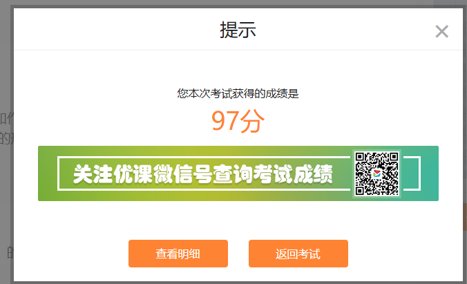

**免责声明：本份答案只能拿到 97 分。**

# 研究生学术道德规范 100 题及答案

1. 克隆人会引发人类尊严和家庭伦理问题，遗传检测引发的隐私保密问题，对基因增强的研究会引发“扮演上帝”的问题，而对转基因食品与农作物的研究则会引发人群健康和生态安全问题。这些由于科学研究而引发的问题属于科学道德中的（**D．生命科学和医学伦理问题**）。  
   A．信息技术伦理问题；B．生态与环境伦理问题；C．纳米技术伦理问题；D．生命科学和医学伦理问题

2. 2011 年 8 月 26 日，曾研究出“人耳鼠”的曹谊林博士再次公开几经重复验证的“人耳鼠”，力证自己学术无造假。近年来，有关“人兽杂交”的秘密科学研究新闻层出不穷，这些研究行为均为文明社会所不齿，也突破了绝大多数社会成员所能接受的道德底线。这种行为破坏了（**B．科研的伦理底线**）。  
   A．科研的求真务实性；B．科研的伦理底线；C．学界公认的学术规范；D．学界的学风

3. 对于涉及人群健康或生态环境的重大科研领域，要通过以下方式（**C．以上都是**），规避科研风险。  
   A．对潜在的群体健康影响、生物安全和生物防护问题进行科学评估；B．及时报告严重不良事件，建立一套分析和预防不良事件的制度；C．以上都是；D．在科学家、人文社科专业人士、环保专家、政策制定者及公民代表共同参加下制定研究规范和伦理准则

4. 在课题申请中，不应超负荷申请。有的科技工作者同时参加了多个课题，应保证每年所有课题的时间加总之和不能超过（**C．12**）个月。  
   A．6；B．9；C．12；D．3

5. 关于科学数据保存期限的规定，一般科学实验记录应当至少保存（**B．5 到 7**）年。  
   A．3 到 5；B．5 到 7；C．7 到 9；D．1 到 3

6. 学术引用有利于将成果放在相关学术史的适当位置。（**B．正确**）  
   A．错误；B．正确

7. 科研成果中的引文可以将未查阅过的文献转抄入自己的引文目录或参考文献目录中。（**A．错误**）  
   A．错误；B．正确

8. 病态科学是科学研究者被其主观性错误所自我欺骗而导致的“科学式”的研究。在一定意义上看，病态科学实属科学的常态。下列情况不属于病态科学的是（**C．伪科学**）。  
   A．一厢情愿的科学；B．独断论式的科学；C．伪科学；D．主观期望的科学

9. 未经正式出版的学术会议论文集刊登的稿件（**B．可以再次在其他正式刊物上发表**）。  
   A．需经会议主办方同意才可以在其他正式刊物上发表；B．可以再次在其他正式刊物上发表；C．不可以再次在其他正式刊物上发表

10. 类似“苏丹红”“毒奶粉”等问题，均属于科技成果的不当应用给社会造成的极其恶劣影响，甚至威胁公众健康和生命，引发群体性事件，影响社会和谐稳定，严重损害公众切身利益。如何防范科技成果的不当应用（**C．以上全部**）。  
    A．增强社会责任感；B．加大惩处力度；C．以上全部；D．加强道德自律意识

11. 在所承担的国家和单位科研课题或者科技项目完成后，不得故意隐瞒关键技术或者资料，故意妨碍后续研究与开发。这一表述属于（**D．遵守有利后续研发原则**）。  
    A．遵守保密原则；B．反对炒作原则；C．同行评议原则；D．遵守有利后续研发原则

12. 掩盖转引，将转引标注为直接引用，引用译著中文版却标注原文版，均属伪注。（**B．正确**）  
    A．错误；B．正确

13. 人文学科与社会科学是人类文明的重要组成部分，二者在实际中几乎没有本质上的分别，而只能从理论上对二者进行界定。下列属于社会科学研究对象的是（**C．人类社会**）。  
    A．人的精神；B．人的情感和价值；C．人类社会；D．人的固有属性

14. 在科研结果及运用的常见问题中，下列属于科研道德范畴的是（**C．侵犯他人著作权**）。  
    A．利益分享不公；B．泄露可识别信息；C．侵犯他人著作权；D．侵犯隐私权

15. 科学共同体的沉淀是（**B．科研规范**）。  
    A．科学规范；B．科研规范；C．科学道德；D．科研道德

16. 研究项目通常是指由一定经费资助的研究课题，下列属于研究项目的是（**C．以上全部**）。  
    A．教育部设立的项目；B．非政府机构设立的项目；C．以上全部；D．企业设立的项目

17. 科研伦理是指科研人员与合作者、受试者和生态环境之间的伦理规范和行为准则。下列不属于违反科研伦理的是（**A．课题研究具有潜在的生态风险**）。  
    A．课题研究具有潜在的生态风险；B．骗取科研资源；C．滥用科研经费；D．弄虚作假

18. 一般而言，自己的论文中只适量地引用他人作品中的观点、论据或内容，而不构成自己作品的主要观点及论据或主要内容，则属于适当引用的范畴。（**B．正确**）  
    A．错误；B．正确

19. 科学研究活动本身会涉及伦理道德，而科研伦理问题的产生有其他自己的根源。例如，某些时候在经济利益冲突的情况下，科研人员可能会迫于药厂方面的压力而不报告不利于新药上市的研究结果。这种情况是由于（**A．利益冲突引发的伦理问题**）。  
    A．利益冲突引发的伦理问题；B．因科研人员的道德观念差异而导致的伦理问题；C．政治因素引发的伦理问题；D．道德困境产生的伦理问题

20. 文献引用出处注释不全，属于（**C．学术失范**）行为。  
    A．学术不端；B．学术腐败；C．学术失范

21. 一位研究生在他的学位论文中，试验与结果分析、讨论、结论等都是自己完成的，而且很有新意。论文通过答辩，并被推荐为优秀学位论文。但在评选中发现该论文的第一部分文献综述却是大量引用另一位已毕业研究生的文献综述，其引用量已超过 50%。你认为该毕业生的论文是否可评为优秀论文？（**A．否**）  
    A．否；B．说不准；C．是

22. 引用未成文的口语实录，是否可以将作者不同时间多次的口语实录自行综合？（**A．否**）  
    A．否；B．无法判断；C．是

23. 高尚的学风道德会对科学文化的发育起到重要的作用。我国老一代科学家淡泊名利、勇攀高峰、无私奉献，以优良的科学道德和学术素养为科技工作者乃至全社会树立了光辉典范。但是目前，我国科学文化发育严重滞后于科学技术发展的内在要求，下列不属于这种严重滞后的表现的是（**B．缺乏创新精神，低水平的重复性科研成果时有发生**）。  
    A．缺乏批评质疑声音；B．缺乏创新精神，低水平的重复性科研成果时有发生；C．在涉及人的科研活动中，缺乏对人的基本尊重，科研伦理底线受到挑战；D．过分看重短期目标，急功近利，缺乏“十年磨一剑”的执着精神

24. 在科研活动中骗取经费、装备和其他支持条件等科研资源，滥用科研资源、浪费科研资源，是否属于学术不端行为？（**C．是**）  
    A．否；B．无法判断；C．是

25. 在一般学术性期刊中对于署名和单位地址，下列描述不正确的是（**C．必须提供作者全名，不可隐名发表**）。  
    A．如果换了新地址，则应在脚注中写上新地址；B．必须提供邮政编码；C．必须提供作者全名，不可隐名发表；D．一个作者下写一个地址

26. 引用未发表作品应征得作者同意并保障作者权益。（**B．正确**）  
    A．错误；B．正确

27. 学术创新绝不是自说自话，而一定是站在前人的基础上完成的，学术创新恰恰是从“旧”事物中生发出来的。必要的引用有利于反对（**C．以上全部**）。  
    A．无视前贤；B．无知霸气；C．以上全部；D．自我作古

28. 2005 年第（**B．59**）届联合国大会通过了一项政治宣言，宣言要求各国禁止所有违反人类尊严的任何形式的克隆人。  
    A．58；B．59；C．60；D．57

29. 一般来说，综述应有作者自己的观点，否则就不成为综述，而是手册或讲座。（**B．正确**）  
    A．错误；B．正确

30. 中国科协的一项调查发现，38.6% 的科技工作者自认为对科研道德和学术规范缺乏足够了解，49.6% 的科技工作者表示自己没有系统地了解和学习过科研道德和学术规范。这种现象反映出在科学道德和学风问题中应该（**D．坚持教育引导**）。  
    A．加强制度规范；B．强化监督约束；C．坚持自我反省；D．坚持教育引导

31. 抄袭剽窃、侵吞他人学术成果，属于（**A．学术不端**）行为。  
    A．学术不端；B．学术腐败；C．学术失范

32. 科研成果中的引文可以采取间接引用，间接引用应使用自己的语言来表述引文中的相关内容并加以标注。（**B．正确**）  
    A．错误；B．正确

33. （**D．科学精神、科研伦理**）是科学道德的思想内核，（**D．科学精神、科研伦理**中的“科研伦理”）是科学道德在伦理层面上的反映。  
    A．学术精神、科研伦理；B．科学精神、学术伦理；C．学术精神、学术伦理；D．科学精神、科研伦理

34. 以人类为实验对象，实验只能由具备科研资格的人员操作，如果有学生参加研究，应有相关教师负责安排和监督，以保证（**B．所有实验步骤高度完善且充分体现人道主义精神**）。  
    A．所有实验步骤的科学性和结果的准确性；B．所有实验步骤高度完善且充分体现人道主义精神；C．所有研究资料的安全与保密

35. 在专业学术会议上做过的口头报告或者以摘要、会议墙报的形式发表过的初步研究结果的完整报告（**C．可以再次发表**）。  
    A．不可以再发表；B．发表时应加以说明；C．可以再次发表

36. 《教育部关于加强学术道德建设的若干意见》中指出，我们要树立（**D．法制**）观念，保护知识产权、尊重他人劳动和权益。  
    A．道德；B．学术道德；C．法制法规；D．法制

37. 学术界一般认为，在涉及人的科研活动中要遵守学界公认的四项基本伦理原则。下列不属于这四项基本原则的是（**A．独立原则**）。  
    A．独立原则；B．不伤害原则；C．公正原则；D．尊重原则

38. 人文社会科学的理论成果一般要经过（**C．五**）年以上的检验才能获得公正有效的评价。  
    A．四；B．三；C．五

39. 未经授权，非作者和出版机构不得随意改动书的内容。（**B．正确**）  
    A．错误；B．正确

40. 把注释的内容置于本页下端，在需要的地方用①、②之类的序号标示。这种注释的形式属于（**A．脚注**）。  
    A．脚注；B．尾注；C．夹注

41. 篡改通常表现为用个人主观意愿对科研结果横加干预，篡改行为严重地违背了科学研究中的基本规范要求，其结果必然不具有可重复性。下列属于篡改行为的是（**A．拼凑数据**）。  
    A．拼凑数据；B．不尊重他人学术思想、学术观点；C．将他人的论文翻译成外文发表；D．不尊重科学和实验结果

42. 陈某某于 2018 年在某经济学刊上发表了一篇论文，再将该论文标题和内容做了个别修改后，又于 2019 年在另一经济学刊物上刊出。这种行为属于科研不当行为中的（**B．基于产出压力的不当科研**）。  
    A．违反科学规则；B．基于产出压力的不当科研；C．不正当的同行关系；D．数据的不正当使用

43. 关于个人成果署名，下列表述正确的是（**C．个人发表学术论著，有权按照自己意愿署名**）。  
    A．可以随意拉名人署名；B．主编、导师即使没有参与论文写作，也可以署名；C．个人发表学术论著，有权按照自己意愿署名

44. 关键词一般选取 3—8 个，置于内容摘要的下方和正文的上方。（**B．正确**）  
    A．错误；B．正确

45. 在科研课题申请过程中，资助单位要做到程序的公开、透明，具有相同资质的申请人应该有相同的机会获得资助。（**A．同行匿名评审制度**）在很大程度上提供了保证。  
    A．同行匿名评审制度；B．大众匿名评审制度；C．权威监督评审制度；D．同行监督评审制度

46. 美国的一项调查统计，43% 的教员反映有同行将大学资源不合理地用于私人目的，有三分之一的教员反映有同行在研究论文上不当署名，有 22% 反映有同行忽视、草率使用数据的情况。这些现象表明（**D．科研不当行为更为常见**）。  
    A．科研不端行为更为常见；B．科学不当行为更为常见；C．科学不端行为更为常见；D．科研不当行为更为常见

47. 论文以不同或同一种文字在同一期刊的国际版本上再次发表（**B．属于重复发表**）。  
    A．不属于一稿多投；B．属于重复发表；C．属于一稿多投

48. 受试者因参与研究而承担风险、耗费时间和精力，或遭受意外的人身伤害的，应该得到公平的经济补偿和医疗救助。这体现出公正原则中的（**D．坚持回报公正**）。  
    A．坚持程序公正；B．坚持分配公正；C．坚持待遇公正；D．坚持回报公正

49. 在合作研究中，故意隐瞒应共享的信息，不提供相关数据和资源等。根据相关加强科研规范的措施和意见，这种行为违反了科研人员须遵守科研规范中的（**A．公开原则**）。  
    A．公开原则；B．公正原则；C．尊重知识产权；D．诚实原则

50. 学生是否可以随意使用导师在课堂教学、个别辅导以及作业批改中阐发的学术理念和思想？（**A．否**）  
    A．否；B．无法判断；C．是

51. 在世界范围内，人们普遍把一个学者的作品（**C．被正面引用的频率**）作为衡量该学者地位与价值的一个重要尺度。  
    A．被翻译成多少种语言；B．流传时间的长短；C．被正面引用的频率

52. 一稿多投是指同一作者，在法定或约定的禁止再投期间，或者在期限以外获知自己作品将要发表或已经发表，在期刊编辑和审稿人不知情的情况下，试图或已经在两种或多种期刊同时或相继发表内容相同或相近的论文。下列属于一稿多投行为的是（**C．将他人的论文翻译成外文发表在国际学术刊物上**）。  
    A．拼凑数据；B．不尊重他人学术思想、学术观点；C．将他人的论文翻译成外文发表在国际学术刊物上；D．不尊重科学和实验结果  

53. 作者撰写论著时，出于提高引用率或扩大影响等目的，不必引而偏引，进行不必要的过度引用。这种行为属于（**A．不当自引**）。  
    A．不当自引；B．模糊引注；C．著而不引；D．过度他引

54. 没有批判精神的学术是没有生气的。对待具体的学术性著作既要有忠实的介绍、同情的理解，也需要有批判的超越。以下不属于规范的学术批判的是（**C．个人好恶**）。  
    A．引用最新的研究成果；B．尽量引用国外权威性的意见；C．个人好恶；D．尽量引用国内权威性的意见

55. 在对学术失范行为的处理中，研究生管理处或学位办公室对相关材料进行审定后，起草处分、处理文件，主管校领导签发。对在校研究生给予留校察看和开除学籍等处分，需（**B．校长办公室**）会议讨论决定。  
    A．学位办公室；B．校长办公室；C．研究生院；D．研究生管理处

56. 导语也称前言、导言，通常在学位论文或篇幅较长的论文中出现，导语应明确交待该领域的学术史，不能闭门造车、自说自话。下列哪个选项不属于导语基本要素的是（**B．研究的计划**）。  
    A．研究的价值；B．研究的计划；C．研究所用材料的来源；D．研究方法

57. 科研规范具有（**C．稳定性、连续性**）的规制性安排。  
    A．连续性、权威性；B．权威性、普遍性；C．稳定性、连续性；D．稳定性、权威性

58. 在项目设计、数据材料采集分析、公布科研成果等方面没有保证数据的有效性和准确性。根据相关加强科研规范的措施和意见，这种行为违反了科研人员须遵守科研规范中的（**D．诚实原则**）。  
    A．公开原则；B．公正原则；C．尊重知识产权；D．诚实原则

59. 一些作者把原作者的研究进行改头换面，再用自己的语言叙述出来，并当作自己的论述而不注明出处。这种行为虽然在表达上可能是作者自己的话，实际上作者只是挪用了别人的观点，并不是自己的研究，实际是一种剽窃行为。这种引用属于（**D．著而不引**）。  
    A．引而不著；B．有意漏引；C．过度他引；D．著而不引

60. 1964 年，新疆的一位年轻人郝天护给时任中国科学院力学研究所所长钱学森写信，指出钱学森近期发表的一篇力学论文中有一处需要商榷。钱学森当时在力学界已经绝对权威，但收到来信后，不仅亲笔回信，承认错误，更鼓励郝天护将自己的观点写成文章，并推荐发表在《力学学报》。这体现出钱学森作为一名合格科技工作者的（**D．严谨作风**）。  
    A．诚信品行；B．责任意识；C．人文素养；D．严谨作风

61. 人文教育是高等教育的重要组成部分，而人文学科是人文教育的承载体，下列不属于人文学科研究对象的是（**C．人类社会**）。  
    A．人的精神；B．人的情感和价值；C．人类社会；D．人的观念

62. 在高等学校中，有些研究活动是为了对学生进行相关的学术训练。下面不属于这种训练目的的是（**D．发现新知**）。  
    A．掌握原理；B．学习研究方法；C．了解研究手段；D．发现新知

63. 引用未发表作品（**C．应征得作者同意并保障作者权益**）。  
    A．可以不经作者同意，只要注明出处即可；B．只能采用直接引用的方式；C．应征得作者同意并保障作者权益

64. 踏实严谨的工作习惯是科研活动的基本要求。在科研工作中，每一个实验过程、每一条实验记录、每一个实验结果都不得半点马虎，都需要科研人员如实记录、仔细整理、认真分析、得出结论。这种品质属于科研工作者应具备的（**D．严谨作风**）。  
    A．诚信品行；B．责任意识；C．科学方法；D．严谨作风

65. 近年来，教育部、中国科学院、中国科协等部门和团体先后出台了加强科研规范的措施和意见，构成了科研人员遵守科研规范的规制性安排。下列属于当代科技工作者应该坚持的规范的是（**C．以上全部**）。  
    A．公正原则；B．声明与回避原则；C．以上全部；D．公开原则

66. 教育部《学位论文作假行为处理办法》（2012）的主要法律依据是《中华人民共和国学位条例》以及（**D．《高等教育法》**）。  
    A．《著作权法》；B．《专利法》；C．《关于科技工作者行为准则的若干意见》；D．《高等教育法》

67. 学生在论文中复述导师的口语实录和思想时，应不加入学生本人的任何个人意见，并通过注释说明来源。（**B．正确**）  
    A．错误；B．正确

68. 选题应具有可行性是指（**D．选题时必须基于现有的主客观条件和已有的研究基础**）。  
    A．选题应符合相关伦理规范；B．选题具有创造性；C．选题一定能够做出成果；D．选题时必须基于现有的主客观条件和已有的研究基础

69. 学术成果发表时应说明成果的资助背景。（**B．正确**）  
    A．错误；B．正确

70. 学术为天下之公器，只有通过（**C．学术批评**），才能去伪存真、明辨是非、发现真理、杜绝腐败。  
    A．学术审查；B．学术发表；C．学术批评

71. 中文引文注释其内容要遵守必要的学术规范。下列不正确的是（**D．著作类：作者/著作名/出版地点/出版者/出版时间/**）。  
    A．网络文献：作者/文献名/网址/网上发布时间/访问时间；B．报纸类：作者/篇名/报纸名称/出版年月；C．期刊类：作者/篇名/期刊名/年期；D．著作类：作者/著作名/出版地点/出版者/出版时间/

72. 署名问题关乎学风建设，署名者要对其成果承担以下哪些责任？（**C．以上全部**）  
    A．道义责任；B．法律责任；C．以上全部；D．学术责任

73. 学术评价是同行专家或学术机构对评价对象符合特定学术标准的程度做出权威判断的学术活动。下列不属于学术评价的是（**D．学风评估**）。  
    A．学术立项评估；B．学术质量鉴定；C．学术结项评估；D．学风评估

74. 同意刊物转载已经发表的稿件，应明确要求刊物注明（**B．“转载”**）字样，并公开说明原刊载处。  
    A．“同意”；B．“转载”；C．“原稿”

75. 引文应当是作者在撰写论著时确实参考或引用过的文献。如果为了给人一种阅读了大量文献资料、研究基础扎实的印象，而故意在论著中加入大量实际没有参考或引用过的、甚至与本文论题根本不相关的文献，做不相关引用、无效引用。这种行为属于（**D．过度他引**）。  
    A．不当自引；B．模糊引注；C．著而不引；D．过度他引

76. 解决科学道德和学风问题，关键在于抓好教育、制度和监督三个环节。教育是（**D．基础**），制度是（**D．关键**），监督是（**D．保障**），惩防结合、标本兼治。  
    A．基础、保障、关键；B．核心、手段、保证；C．手段、保证、核心；D．基础、关键、保障

77. 《教育部关于加强学术道德建设的若干意见》中指出，当前要通过扎实有效的工作，加强对广大教师、教育工作者和学生的学术道德教育，培养（**D．求真务实、勇于创新、坚韧不拔、严谨自律**）的治学态度和学术精神，努力使他们成为良好学术风气的维护者、严谨治学的力行者、优良学术道德的传承者。  
    A．勇于创新、坚韧不拔、求真务实、严谨自律；B．严谨自律、求真务实、勇于创新、坚韧不拔；C．坚韧不拔、勇于创新、严谨自律、求真务实；D．求真务实、勇于创新、坚韧不拔、严谨自律

78. 《教育部关于加强学术道德建设的若干意见》中指出，要建立学术惩戒处罚制度。对违反学术道德的行为，各级教育行政部门和相关机构一经查实要视具体情况给予（**C．①②③④**），直至解聘等相应的处理和处罚。  
    ①批评教育；②撤销项目；③行政处分；④取消资格、学位、称号  
    A．①③④；B．②③④；C．①②③④；D．①②③

79. 凡是在学术会议论文集刊登的稿件，都不可以再次在其他正式刊物上发表。（**A．错误**）  
    A．错误；B．正确

80. 根据《关于科技工作者行为准则的若干意见》，科技工作者和有关科技管理机构在科研立项、科技成果评审、鉴定、验收和奖励等活动中，相关的评价结论严禁滥用以下哪种用语？（**C．以上全部**）  
    A．国内首创；B．国际先进；C．以上全部；D．国内先进

81. 直接引用超过一定篇幅，可采用（**A．改变排版方式**）等办法来更为清晰地加以区分。  
    A．改变排版方式；B．改变字体颜色；C．加引号的方式

82. 在学术论文署名时，其中一名作者可能为该研究提供了资金资助，可能是该学术领域的领军人物，也可能仅为其他作者提供帮助但并未真正参与该研究，他们并没有对研究做出符合作者身份要求的贡献。这种署名是被学界严格禁止的，该署名属于（**D．荣誉作者**）。  
    A．虚构作者；B．互惠作者；C．权势作者；D．荣誉作者

83. 任鸿隽先生于 1916 年在《科学精神论》一文中首次明确提出科学精神的概念。美国著名学者来维茨将科学精神概括为激情、创造性和诚信三个方面。可见，科学精神是在长期科学实践活动中形成的、贯穿于科研活动全过程的共同信念、价值、态度和行为规范的总称。下列不属于科学精神内涵的是（**C．激情状态**）。  
    A．理性的怀疑精神；B．民主精神；C．激情状态；D．求真精神

84. 科研规范主要是指从事科研活动的行为，其主体是（**C．科学共同体**）。  
    A．科研道德；B．科学道德；C．科学共同体；D．科学规范

85. 学术评价是同行专家或学术机构对评价对象符合特定学术标准的程度做出权威判断的学术活动。下列不属于学术评价的是（**B．学风评估**）。  
    A．学术水平评估；B．学风评估；C．学术成果鉴定；D．学术贡献评估

86. 日本学界素以学术严谨著称。据《朝日新闻》报道，日本麻醉科学会 2011 年 6 月 29 日指出，该学会会员、原东邦大学学部藤井善隆自 1990 年至 2011 年间在国际外学术杂志上发表的 212 篇论文中至少伪造了 172 篇。近年来欧美国家也相继曝出相关问题。这突出说明当前科学道德与学风问题具有（**A．全球性**）。  
    A．全球性；B．行业性；C．必然性；D．个案性

87. 学界公认的科研规范中，规定在保守国家秘密和保护知识产权的前提下，公开科研过程和结果相关信息，追求科研活动社会效益最大化。这条原则属于当代科研工作者应该坚持的（**D．公开原则**）。  
    A．诚实原则；B．尊重知识产权原则；C．声明与回避原则；D．公开原则

88. 编书（如教科书）时将他人的作品当作书中的某篇章，不属于《著作权法》所说的合理引用，而应属于复制他人作品的行为。（**B．正确**）  
    A．错误；B．正确

89. 文中参考文献如果故意回避的资料数量较大，或是涉及论文的主要观点、方法、论据，则实际上已经形成抄袭，构成侵权。（**B．正确**）  
    A．错误；B．正确

90. 韩国首尔大学黄禹锡因违反科学道德，犯有诈骗、科研剽窃等行为，被拉下“国家最高科学家”神坛，最终以被判处有期徒刑 18 个月、缓期两年执行的结局收场。这一事件极大地伤害了韩国公众对科学家的信任，也对韩国科技界的国际形象带来负面影响。该案例突出反映了当前科学道德与学风问题具有（**A．社会性**）。  
    A．社会性；B．行业性；C．必然性；D．个案性

91. 在校研究生对违反学术规范所受处分决定如有异议，向学校学生申诉处理委员会提出书面申诉的时限为接到处分决定书之日起（**D．5 个工作日内**）。  
    A．15 个工作日内；B．20 个工作日内；C．30 个工作日内；D．5 个工作日内

92. 对科学研究中的不端行为更重要的是要从源头采取措施，教育为本、正本清源、回归科学，制止科学道德与学风蜕变趋势的发展，努力让学术风气回归到科学的轨道。作为解决科学道德和学风问题基础的是（**D．教育**）。  
    A．制度；B．监督；C．惩防结合、标本兼治；D．教育

93. 伪科学是指违背科学方法和通常程序，将非科学的理论当作科学传播推广并以此追逐名利的活动。伪科学大致可分为文化类伪科学、迷信类伪科学、未知领域的伪科学和江湖骗术类伪科学四类。下列不属于伪科学的是（**B．量子力学**）。  
    A．“长白山水怪”的离奇解释；B．量子力学；C．夸大疗效、隐瞒副作用并借助洗脑式广告的保健品；D．灵学

94. 科研规范是基于科研道德和科学共同体共识的、具有稳定性和连续性的规制和安排，因而具有文化的意义，要求研究者自觉遵守和共同维护。下列（不属于：题干错误）属于当代科技工作者应该坚持的规范是（**A．不伤害原则**）。  
    A．不伤害原则；B．公正原则；C．尊重原则；D．诚实原则  

95. 1997 年国务院第 169 次常务会议通过了（**B．《国家自然科学基金条例》**），其规定申请人、参与者伪造或者变造申请材料的，由基金管理机构给予警告。  
    A．《关于科技工作者科学道德规范（试行）》；B．《国家自然科学基金条例》；C．《教育部关于加强学术道德建设的若干意见》；D．《公民道德建设实施纲要》  

96. 谁对成果承担相应的学术责任、道义责任和法律责任？（**C．署名者**）  
    A．整理者；B．出版者；C．署名者

97. 2001 年 9 月，合肥工业大学调查证实，合肥工业大学人工智能研究所杨敬安教授、博士生导师截至 1999 年底，有 6 篇论文严重抄袭国外学者的研究成果，最终被开除党籍。这件事（**C．以上都是**）。  
    A．毁坏了知识分子的社会公信力；B．造成了学术资源的浪费；C．以上都是；D．破坏了正常的学术秩序

98. 皖西学院生命与化学系副教授邱某，2008 年利用专业能力，以化学合成的方法研制出固体和液体冰毒共计 11947.22 克。经鉴定，其中含毒品成分 2363.88 克。六安市中级人民法院一审判处邱某死刑，剥夺政治权利终身，并没收个人全部财产。该反面教材提醒我们，作为一名合格的学者应该具备（**C．责任意识**）。  
    A．严谨作风；B．科学方法；C．责任意识；D．诚信品行

99. 一稿多投有多种形式，比如作者把 A 文章分成 B 文章和 C 文章，然后把 A、B、C 三篇文章投递给不同的期刊。这种一稿多投的形式属于（**B．肢解型投稿**）。  
    A．改头换面型投稿；B．肢解型投稿

100. 学术规范是一种“行政化”的操作，是学术共同体成员必须遵循的准则。（**A．错误**）  
     A．错误；B．正确
